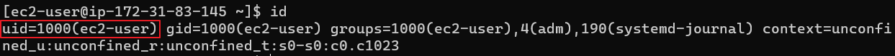

[Back to ACG DCA](../main.md)

# Docker Community Edition

### Concept) Docker Community Edition
- A free and open source version of the Docker Engine.
- Installation Page : <a href="https://docs.docker.com/get-docker/" target="_blank">https://docs.docker.com/get-docker</a>

<br><br>

## Hands on) Installing Docker
1. [CentOS](#1-installing-docker-on-centos)
2. [Ubuntu](#2-installing-docker-on-ubuntu)

<br>

### 1. Installing Docker on CentOS
- Install the required packages 
  ```
  sudo yum install -y device-mapper-persistent-data lvm2
  ```
  - Packages
    - device-mapper-persistent-data 
    - lvm2
- Add the docker-ce repo
  ```
  sudo yum-config-manager --add-repo https://download.docker.com/linux/centos/docker-ce.repo
  ```
  - RHEL(RedHat) can use CentOS repo.
- Install Docker CE, the CLI, and containerd
  ```
  sudo yum install -y docker-ce docker-ce-cli containerd.io
  ```
  - Latest version for every packages.
- Start and enable docker.
  ```
  sudo systemctl start docker
  ```
  ```
  sudo systemctl enable docker
  ```
  - Verify the installation.
    ```
    sudo systemctl status docker
    ```
    ```
    sudo docker version
    ```
- Give a user the access to the docker
  - Verify the current user
    ```
    id
    ```
    
  - Add user to the docker group.
    ```
    sudo usermod -aG docker [user_name]
    ```
  - Test by command without *sudo*.
    ```
    docker version
    ```
    
- Run hello-world container.
  ```
  docker run hello-world
  ```

<br>

### 2. Installing Docker on Ubuntu
- See [here](../../acg_docker_quick_start/01/note.md#2-step-by-step-installation).


<br>

[Back to ACG DCA](../main.md)