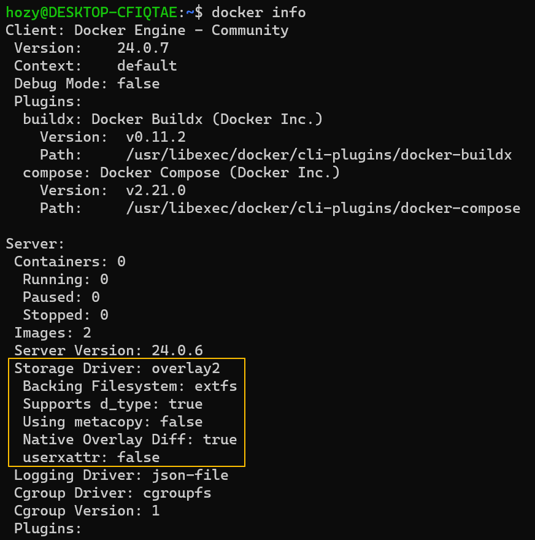

[Back to ACG DCA](../main.md)

# Selecting a Storage Driver

### Concept) Storage Driver
- Desc.)
  - Storage drivers provide a pluggable framework for managing the temporary, internal storage of a container's writable layer.
  - Docker supports a variety of storage drivers.
    - e.g.)
      - overlay2
        - File-based storage
        - Default for Ubuntu and CentOS 8+
      - devicemapper
        - Block storage
        - More efficient for doing lots of writes.
        - Default for CentOS 7 and earlier.
    - How to check the current storage driver.
      ```
      docker info
      ```
      

<br>

[Back to ACG DCA](../main.md)