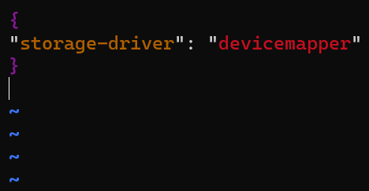
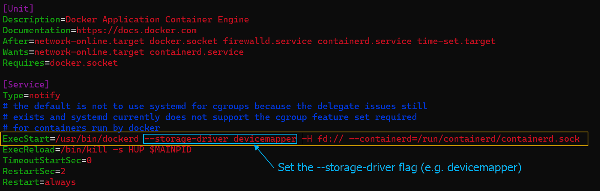

[Back to ACG DCA](../main.md)

# Selecting a Storage Driver

### Concept) Storage Driver
- Desc.)
  - Storage drivers provide a pluggable framework for managing the temporary, internal storage of a container's writable layer.
  - Docker supports a variety of storage drivers.
    - e.g.)
      - overlay2
        - File-based storage
        - Default for Ubuntu and CentOS 8+
      - devicemapper
        - Block storage
        - More efficient for doing lots of writes.
        - Default for CentOS 7 and earlier.
    - How to check the current storage driver.
      ```
      docker info
      ```
      
    - [Official Guide by Docker](https://docs.docker.com/storage/storagedriver/select-storage-driver/)

<br>

### Tech.) Overwriting the Existing Storage Driver
There are two ways to do this.
1. [Edit the daemon config file.](#way1-edit-the-daemon-config-file) (Recommended)
2. [Pass a flag to the docker daemon](#way2-pass-a-flag-to-the-docker-daemon) (Not recommended)

<br>

#### Way1) Edit the daemon config file.
- Edit */etc/docker/daemon.json*
  ```
  sudo vim /etc/docker/daemon.json
  ```
  - By default, this file does not exist.   
    
- Restart Docker and check the status.
  ```
  sudo systemctl restart docker
  ```
  ```
  systemctl status docker
  ```

<br>

#### Way2) Pass a flag to the docker daemon.
- Edit */usr/lib/systemd/system/docker.service*
 ```
 sudo vim /usr/lib/systemd/system/docker.service
 ```
 - Set *--storage-driver* flag.
   ```
   ExecStart=/usr/bin/dockerd --storage-driver [storage_driver_name] -H fd:// --containerd=/run/containerd/containerd.sock
   ```
   
- Reload the daemon and restart Docker
 ```
 sudo systemctl daemon-reload
 ```
 ```
 sudo systemctl restart docker
 ```
 - Check if the change is made.
   ```
   docker info
   ```
      


<br>

[Back to ACG DCA](../main.md)