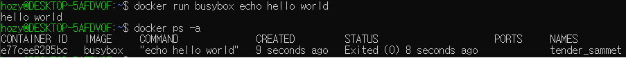

[Back to ACG DCA](../main.md)

# Running a Container

- Commands
  - [Run Containers](#run-containers)
  - [List Containers](#list-containers)
  - [Start/Stop Containers](#start-and-stop-containers)
  - [Delete Containers](#delete-containers)

<br><br>

## Run Containers
<table>
  <tr>
    <td> Command
    </td>
    <td> Description
    </td>
  </tr>
  <tr>
    <td> <code>docker run [image_name]:[tag]</code>
    </td>
    <td> - Simply run an image.
    </td>
  </tr>
  <tr>
    <td> <code>docker run [image_name]:[tag] [commands_and_arguments]</code>
    </td>
    <td> - Run a container with a command and arguments. <br><br> - e.g.) <code>docker run busybox echo hello world!</code> <br> 
    </td>
  </tr>
</table>

-  Running with a variety of flags.
   -  e.g.)
      ```
      docker run -d --name nginx --restart unless-stopped -p 8080:80 --memory 500M       --memory-reservation 256M nginx
      ```
      - Options used
        |Option|Meaning|
        |:-----|:------|
        |-d, --detach              |           Run container in background and print container       ID|
        |--name [string]             |       Assign a name to the container|
        |--restart [string]          | - no : Never restart the container. <br> - on-failure :       Only if the container fails. <br> - always : Always restart the container whether it       succeeds or fails. Also starts the container automatically on daemon startup. <br> -       unless-stopped : Always restart the container whether it succeeds or fails, and on       daemon startup, unless the container was manually stopped.       |
        |-p, --publish list        |           Publish a container's port(s) to the host|
        |-m, --memory [bytes]        |           Memory limit|
        |--memory-reservation [bytes]|       Memory soft limit|

<br><br>


## List Containers
<table>
  <tr>
    <td> Command
    </td>
    <td> Description
    </td>
  </tr>
  <tr>
    <td><code>docker ps</code>
    </td>
    <td>List any currently running containers.
    </td>
  </tr>
  <tr>
    <td><code>docker ps -a</code>
    </td>
    <td>List all containers, both running and stopped.
    </td>
  </tr>
</table>
<br><br>


## Start and Stop Containers
<table>
  <tr>
    <td> Command
    </td>
    <td> Description
    </td>
  </tr>
  <tr>
    <td><code>docker container start [container_id]</code>
    </td>
    <td>Stop a container.
    </td>
  </tr>
  <tr>
    <td><code>docker container stop [container_id]</code>
    </td>
    <td>Start a container.
    </td>
  </tr>
</table>
<br><br>

## Delete Containers
<table>
  <tr>
    <td> Command
    </td>
    <td> Description
    </td>
  </tr>
  <tr>
    <td><code>docker container rm [container_id]</code>
    </td>
    <td>Delete a container (but it must be stopped first).
    </td>
  </tr>
</table>
<br><br>

<br>

[Back to ACG DCA](../main.md)