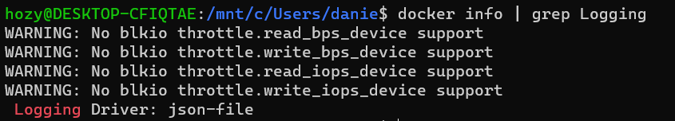
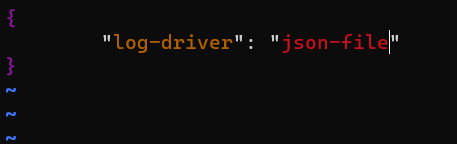
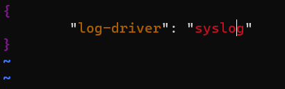
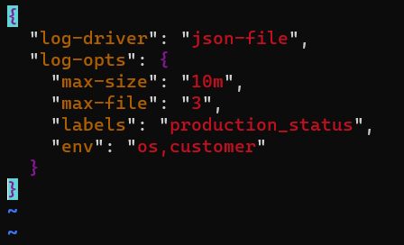
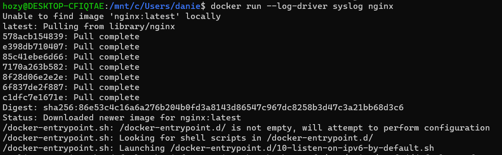

[Back to ACG DCA](../main.md)

# Configuring Logging Drivers

### Concept) Logging Driver
- Def.)
  - A pluggable framework for accessing log data from services and containers in Docker.
- Props.)
  - Docker supports a variety of logging drivers.

<br>

### Tech.) Setting a default logging driver.
- We will set a system wide default logging driver.
  - We can overwrite containers' own drivers afterwards.
    - cf.) Recall that a single [storage driver](../02_04/note.md#concept-storage-driver) should be set for the whole system.
- Hands on.
  - Check the current logging driver.
    ```
    docker info | grep Logging
    ```
    
    - *json-file* is the current default.
  - We can set by declaring the driver.
    ```
    sudo vim /etc/docker/daemon.json
    ```
    - e.g.)
      - *json-file* (current default)   
        
      - *syslog* (local system logging)   
        
  - *json-file* supports various options.
    - Add with "log-opts" tag.
    - Refer to the [official document](https://docs.docker.com/config/containers/logging/configure/) for the further information.
    - e.g.)   
      
  - Restart docker anytime after changing the *daemon.json* file.
    ```
    sudo systemctl restart docker
    ```

<br>

### Tech.) Overwriting the setting in an individual container.
- Specify the log driver when making a docker run command.
  ```
  docker run --log-driver [driver_name] --log-opt [options] [container_name]
  ```
  - e.g.) syslog for the nginx container   
    

<br>

[Back to ACG DCA](../main.md)