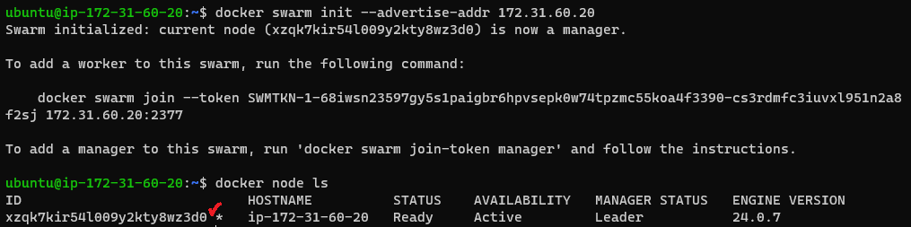
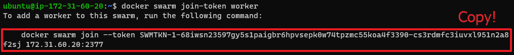
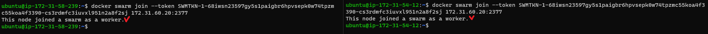
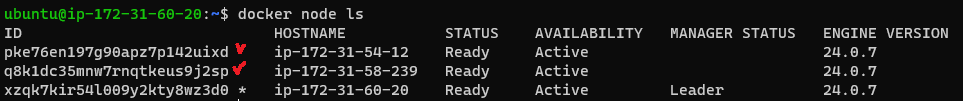
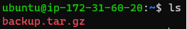

[Back to ACG DCA](../main.md)

# Docker Swarm

### Concept) Docker Swarm
- Props.)
  - It allows for easily building a distributed cluster where a container can be run across multiple available servers.
  - [Official Documentation](https://docs.docker.com/engine/swarm/key-concepts/)

<br>

#### Hands on) Configuring Docker Swarm Manager
- Prerequisites)
  - Three servers
    - One Ubuntu server, with medium size
      - This will be the Swarm Manager
    - Two Ubuntu servers, with small sizes
      - These will be the Worker Nodes
- Hands on
  1. Swarm Manager Configuration
     1. [Install Docker CE](../../acg_docker_quick_start/01/note.md#2-step-by-step-installation).
     2. Initialize the swarm.
        ```
        docker swarm init --advertise-addr [private_ip_addr]
        ```
     3. Check the docker swarm info
        ```
        docker info
        ```
     3. List all the nodes in the swarm. (Currently the manager only!)
        ```
        docker node ls
        ```
        
  2. Swarm Node Configuration
     1. [Install Docker CE](../../acg_docker_quick_start/01/note.md#2-step-by-step-installation) on Worker Nodes.
     2. Get the join command from the Manager Node.
        ```
        docker swarm join-token worker
        ```
        - Copy the command!    
          
     3. Paste the commands to the worker nodes.
        
     4. In the Manager Node, check if the nodes are properly joined.
        ```
        docker node ls
        ```
        

<br>

#### Hands on) Backup the Docker Swarm
- Hands on
  - In the Manager Node...
    1. Stop Docker
       ```
       sudo systemctl stop docker
       ```
    2. Create the backup file using ```tar``` at ```/var/lib/docker/swarm```
       ```
       sudo tar -zvcf backup.tar.gz /var/lib/docker/swarm
       ```
       - Refer to the [Compressed Files in Linux](../../../linux/acg_learn_by_doing/6_2/note.md) for more info about ```tar```.
       - Backup has been created at the home directory.   
         
    3. Start Docker again.
       ```
       sudo systemctl start docker
       ```

<br>

#### Hands on) Backup the Docker Swarm
- Hands on
  - In the Manager Node...
    1. Stop Docker
       ```
       sudo systemctl stop docker
       ```
    2. Truncate ```/var/lib/docker/swarm```.
       ```
       sudo rm -rf /var/lib/docker/swarm
       ```
    3. Restore the ```/var/lib/docker/swarm```, using our previous backup file
       ```
       sudo tar -zxvf backup.tar.gz -C /var/lib/docker/swarm
       ```
    4. Start Docker again.
       ```
       sudo systemctl start docker
       ```
    5. Check if the nodes are joined properly.
        ```
        docker node ls
        ```
       

<br>

[Back to ACG DCA](../main.md)