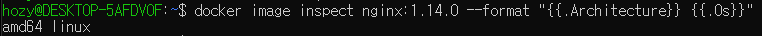

[Back to ACG DCA](../main.md)

# Docker Images

### Concept) Docker Image
- Def.)
  - A file containing the code and components needed to run software in a container.   

 

### Concept) Layered File System
- Usage)
  - Containers and images use a layered file system.
    - Each layer contains only the differences from the previous layer.
      - e.g.) nginx   
        
  - The image consists of on or more read-only layers, while the container adds one addition writable layer.    
    
- Advantage)
  - Allows multiple images and containers to share the same layers.
    - Smaller overall storage footprint
    - Faster image transfer
    - Faster image build 

 

### Tech) Image Related Commands
<table>
  <tr>
    <td>Command</td>
    <td>Meaning</td>
  </tr>
  <tr>
    <td><code>docker pull [image_name:tag]</code>  <code>docker image pull [image_name:tag]</code></td>
    <td>- Pull (download) an image</td>
  </tr>
  <tr>
    <td><code>docker image history [image_name:tag]</code></td>
    <td>- List the layers used to build an image</td>
  </tr>
  <tr>
    <td><code>docker image ls</code>  <code>docker images</code></td>
    <td>List images</td>
    <td></td>
  </tr>
  <tr>
    <td><code>docker image inspect [image_name:tag]</code></td>
    <td>- Get detailed information about an image in json format.   - Use Go template to get only a subset of information.   <code>docker image inspect [image_name:tag] --format [template_text]</code>    </td>
  </tr>
  <tr>
    <td><code>docker image rm [image_name:tag]</code>    <code>docker rmi [image_name:tag]</code></td>
    <td>- Delete an image.</td>
    <td></td>
  </tr>
  <tr>
    <td><code>docker image prune</code></td>
    <td>- Delete unused (dangling) images from the system.</td>
    <td></td>
  </tr>
  <tr>
    <td><code>docker run [image_name:tag]</code></td>
    <td>- Run an image.</td>
    <td></td>
  </tr>
</table>

 

[Back to ACG DCA](../main.md)