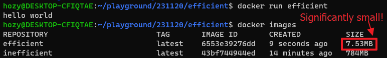

[Back to ACG DCA](../main.md)

# Multi-Stage Build

### Concept) Building an Efficient Image
- We should build images as small as possible
  - Why?)
    - Docker images are the layered files.
    - So they must generate ephemeral containers that can be started, stopped, and destroyed easily.
- Tips)
  - Put things that are less likely to change on lower-level layers.
  - Don't create unnecessary layers.
  - Avoid including any unnecessary files, packages, etc. in the image.

<br>

### Concept) Multi-Stage Build
- Def.)
  - Multiple ```FROM``` directives in the Docker file.
- Prop.)
  - Each ```FROM``` directive starts a new stage.
    - Each stage begins a completely new set of file system layers
    - It allows you to [selectively copy](#tech-selective-copy) only the files you need from previous layers.
- Advantage)
  - We can make images smaller by selectively copying the files that wee need!
- How?)
  - Name each stage with alias using ```FROM [image] AS [stage_alias]``` syntax.
  - Copy files from the stage using ```COPY --from=[stage_alias] [file_name]```
  - Refer to [the experiment below](#experiment-comparison-between-using-multi-stage-build-and-not) for the usage example.

<br>

#### Experiment) Comparison between using Multi-Stage Build and not.
- Goal)
  - Print "hello world" using a golang executable.
- Prep.)
  - Make directories for the two cases
    ```
    cd ~
    mkdir efficient
    mkdir inefficient
    ```
- Trial 1) Inefficient Build
  - Go to the inefficient directory.
    ```
    cd inefficient
    ```
  - Create a source code file in golang.
    ```
    vim helloworld.go
    ```
    - Code a basic program.
      ```go
      package main
      import "fmt"
      func main() {
        fmt.Println("hello world")
      }
      ```
  - Create a Dockerfile.
    ```
    vim Dockerfile
    ```
    - Docker file goes as follows
      ```Dockerfile
      FROM golang:1.12.4
      # Create a directory
      WORKDIR /helloworld
      COPY helloworld.go .  
      RUN GOOS=linux go build -a -installsuffix cgo -o helloworld .
      # Execute the source code.
      CMD ["./helloworld"]
      ```
  - Build and test the inefficient image.
    ```
    docker build -t inefficient .
    ```
    ```
    docker run inefficient
    ```
    ```
    docker image ls
    ```
    
    - The image that prints "hello world" is too huge!
      - Inefficient!
- Trial 2) Efficient Build
  - Copy ```helloworld.go``` and ```Dockerfile``` to ```../efficient```.
    ```
    cp helloworld.go ../efficient
    cp Dockerfile ../efficient
    ```
    - We will modify Dockerfile only.
    - The source code remains the same.
  - Go to the efficient directory.
    ```
    cd ../efficient
    ```
  - Edit the Docker file as follows.
    ```Dockerfile
    # Alias used for this stage!
    FROM golang:1.12.4 AS compiler
    WORKDIR /helloworld
    COPY helloworld.go .  
    RUN GOOS=linux go build -a -installsuffix cgo -o helloworld .

    # Start a new stage
    FROM alpine:3.9.3
    WORKDIR /root
    # Copy from the previous stage
    COPY --from=compiler /helloworld/helloworld .
    CMD ["./helloworld"]
    ```
  - Go to the efficient directory.
    ```
    docker build -t efficient .
    ```
    ```
    docker run efficient
    ```
    ```
    docker images
    ```
    


<br>

<br>

[Back to ACG DCA](../main.md)