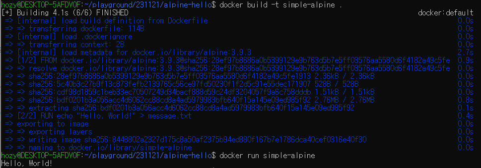
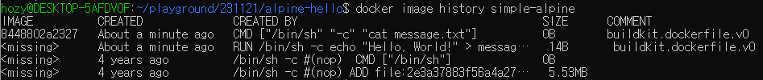
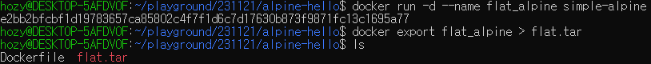
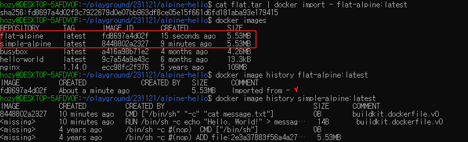

[Back to ACG DCA](../main.md)

# Flattening a Docker Image to a Single Layer

### Concept) Flattening an Image
- In few cases, you may want to take an image with many layers and flatten them into a single layer.
- Docker does not provide an official method for doing this.
  - why?)
    - It goes against [the Docker's layered file system philosophy](../03_01/note.md#concept-layered-file-system).
- Still, you can accomplish this by...
  1. Run a container from the image.
  2. Export the container to an archive using ```docker export```.
  3. Import the archive as a new image using ```docker import```.
- As a result, the image will have only one layer.

<br><br>

### Hands on)
- Procedures
  1. [Create a simple alpine image that generates a txt file and prints it as an output.](#1-create-a-simple-alpine-image-that-generates-a-txt-file-and-prints-it-as-an-output)
  2. [Check the layers in the image created above.](#2-check-the-layers-in-the-image-created-above)
  3. [Flatten the layers into a single layer.](#3-flatten-the-layers-into-a-single-layer)

#### 1. Create a simple alpine image that generates a txt file and prints it as an output
- Create a directory and go there.
  ```
  cd ~
  mkdir alpine-hello
  cd alpine-hello
  ```
- Create a Docker file as follows.
  ```Dockerfile
  FROM alpine:3.9.3
  RUN echo "Hello, World!" > message.txt
  CMD cat message.txt
  ```
- Build and run the image.
  ```
  docker build -t simple-alpine .
  ```
  ```
  docker run simple-alpine
  ```
  

<br><br>

#### 2. Check the layers in the image created above
- Check the history.
  ```
  docker image history simple-alpine
  ```
  
  - We will flatten the above four layers into one.


<br><br>

#### 3. Flatten the layers into a single layer
- Run the above image in the detached mode.
  ```
  docker run -d --name flat_alpine simple-alpine
  ```
- Export the container into a tar archive file.
  ```
  docker export flat_alpine > flat.tar
  ```
  
- Import the archive and make it into an image.
  ```
  cat flat.tar | docker import - flat-alpine:latest
  ```
  
  - Comparison)
    - Both images has the same size.
    - But the flattened one has only one layer.


<br><br>

<br>

[Back to ACG DCA](../main.md)