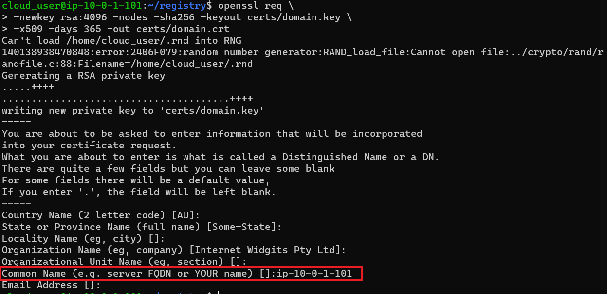
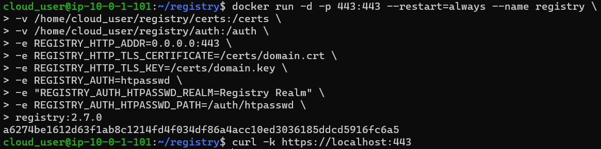
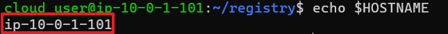
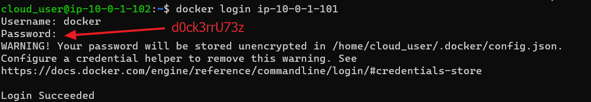

[Back to note](note.md)

# Building a Private Docker Registry

### Directions
Your company has recently decided to use Docker to run containers in production. They have built some Docker images to run their own proprietary software and need a place to store and manage these images. You have been asked to build a secure, private Docker registry for use by the company. In order to verify that everything works, you have also been asked to configure a Docker workstation server to push to and pull from the registry.

To complete this lab, ensure that the following requirements are met for the registry:
- A private Docker registry is running on the Docker registry server using version 2.7.0 of the registry image.
- The container name for the registry should be registry.
- The registry should always automatically restart if it stops or the Docker daemon or server restarts.
- The registry should require authentication. Set up an initial account with the username ```docker``` and the password ```d0ck3rrU73z```.
- The registry should use TLS with a self-signed certificate.
- The registry should listen on port 443.

Set up the Docker workstation server to meet the following requirements:
- Docker is logged in to the private registry.
- Docker is configured to accept the self-signed cert. Do not turn off certificate verification using the insecure-registries setting.
- To confirm that everything is working, push a test image called ```ip-10-0-1-101:443/test-image:1``` to the private registry. You can pull any image from Docker hub and tag it with ```ip-10-0-1-101:443/test-image:1``` as a test.
- Delete the test image locally and pull it from the registry.
- If you get stuck, feel free to check out the solution video, or the detailed instructions under each objective. Good luck!

<br><br>

### Environment
|Registry Server|Workstation Server|
|:--------------|:-----------------|
|- Username : cloud_user <br> - Password : (ihVKEI9 <br> - Docker Registry Private IP : 10.0.1.101 <br> - Docker Registry Public IP : 44.212.69.154|- Username : cloud_user <br> - Password : (ihVKEI9 <br> - Docker Registry Private IP : 10.0.1.102 <br> - Docker Registry Public IP : 3.83.107.41|

<br><br>

### Hands on
#### 1. Building a private Registry on the Registry Server
   - auth
     ```
     mkdir -p ~/registry/auth
     cd ~/registry
     ```
     ```
     docker run --entrypoint htpasswd registry:2.7.0 -Bbn docker d0ck3rrU73z > auth/htpasswd
     ```

   - cert
     ```
     mkdir ~/registry/certs
     ```
     ```
     openssl req \
     -newkey rsa:4096 -nodes -sha256 -keyout certs/domain.key \
     -x509 -days 365 -out certs/domain.crt
     ```
     
     - The host name can be found with the following command.
       ```
       echo $HOSTNAME
       ```


#### 2. Run the created private registry on the Registry Server
   ```
   docker run -d -p 443:443 --restart=always --name registry \
   -v /home/cloud_user/registry/certs:/certs \
   -v /home/cloud_user/registry/auth:/auth \
   -e REGISTRY_HTTP_ADDR=0.0.0.0:443 \
   -e REGISTRY_HTTP_TLS_CERTIFICATE=/certs/domain.crt \
   -e REGISTRY_HTTP_TLS_KEY=/certs/domain.key \
   -e REGISTRY_AUTH=htpasswd \
   -e "REGISTRY_AUTH_HTPASSWD_REALM=Registry Realm" \
   -e REGISTRY_AUTH_HTPASSWD_PATH=/auth/htpasswd \
   registry:2.7.0
   ```
   - Test.
     ```
     curl -k https://localhost:443
     ```
     

#### 3. Get the hostname of the Registry Server
   ```
   echo $HOSTNAME
   ```
   


#### 4. In the Workstation Server, login to the created registry in the Registry Server.
   - Provide the public certificate to the Docker engine.
     - Create a directory at local.
       ```
       sudo mkdir -p /etc/docker/certs.d/ip-10-0-1-101
       ```

     - Copy certificate from the registry server.
       ```
       sudo scp cloud_user@ip-10-0-1-101:/home/cloud_user/registry/certs/domain.crt /etc/docker/certs.d/ip-10-0-1-101
       ```

   - Log in to the private registry
     ```
     docker login ip-10-0-1-101
     ```
     


#### 5. Test tag and push to the private registry.
   - Pull hello-world image from Docker Hub
     ```
     docker pull hello-world
     ```

   - Tag the image.
     ```
     docker tag hello-world ip-10-0-1-101/test-image:1
     ```

   - Upload the image
     ```
     docker push ip-10-0-1-101/test-image:1
     ```


<br><br>

[Back to note](note.md)