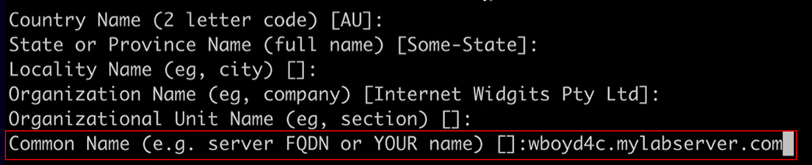
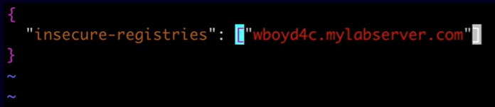
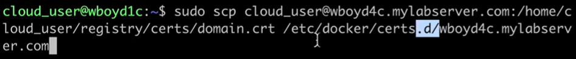

[Back to ACG DCA](../main.md)

# Docker Registries

### Concept) Docker Registry
- A Docker registry is responsible for storing and distributing Docker images.
- Types) 
  - Public Registry
    - Docker Hub
  - Private Registry
    - You can create your own registries using Docker's open source registry software.
    - Docker Trusted Registry (Docker Enterprise only)

<br>

#### Tech.) How to create a registry
- How?)
  - Run a container using the registry image.
  - Publish port 5000. 
- Hands on)
  - Creating a registry.
    - Run Docker's open source registry software with the port 5000.
      ```
      docker run -d -p 5000:5000 --restart=always --name [registry_name] registry:2.7
      ```
      - Creating a registry with the default configuration
        - ```-e REGISTRY_[env_var_setup]``` : Name the environment variable into ```REGISTRY_```
          - This will allow you to modify the variables in the default yaml file.
        - e.g.) The command below defines the environment variable for the log level.
          ```
          docker run -d -p 5000:5000 --restart=always --name registry -e   REGISTRY_LOG_LEVEL=debug registry:2
          ```
          - Check if the debugging is working. See the log.
            ```
            docker logs registry
            ```
  - Removing the registry.
    - Stop and remove the container.
      ```
      docker container stop [registry_name] && docker container rm -v registry
      ```
      - ```-v``` : Remove all the volume mounted on the registry.


<br>

#### Concept) Registry Security Setup
- By default, the registry is completely unsecured.
- It does not use TLS and does not require authentication.
  - Thus, we should...
    1. Use TLS with a certificate.
    2. Require user authentication.
- Hands on
  - Generate an htpasswd file to be used for authentication:
    - Create a directory at home
      ```
      mkdir ~/registry
      cd ~/registry
      ```
    - Create a ```auth``` directory at registry
      ```
      mkdir auth
      ```
    - Generate a htpasswd file.
      - Temporarily run our registry image to run htpasswd and output the result to  ```htpasswd``` file.
        ```
        docker run --entrypoint htpasswd httpd:2 registry:2 -Bbn [id] [password] > auth/htpasswd
        ```
  - Generate a self-signed certificate. 
    - Create a ```certs``` directory at registry
      ```
      mkdir ~/registry/certs
      ```
    - ```openssl``` to generate a cert.
      ```
      openssl req \
      -newkey rsa:4096 -nodes -sha256 -keyout certs/domain.key \
      -x509 -days 365 -out certs/domain.crt
      ```
      - Press Enter for most of the prompts except **Common Name**.
      - Common Name : Enter the public host name of your server where your registry resides.   
        
  - Run the registry with authentication and TLS enabled.
    ```
    docker run -d -p 443:443 --restart=always --name registry \
    -v [user_home_dir]/registry/certs:/certs \
    -v [user_home_dir]/registry/auth:/auth \
    -e REGISTRY_HTTP_ADDR=0.0.0.0:443 \
    -e REGISTRY_HTTP_TLS_CERTIFICATE=/certs/domain.crt \
    -e REGISTRY_HTTP_TLS_KEY=/certs/domain.key \
    -e REGISTRY_AUTH=htpasswd \
    -e "REGISTRY_AUTH_HTPASSWD_REALM=Registry Realm" \
    -e REGISTRY_AUTH_HTPASSWD_PATH=/auth/htpasswd \
    registry:2.7
    ```
    - Port is 443 because we are using TLS.
    - Must enter the home directory of the user at [user_home_dir]
      - e.g.) ```/home/cloud_user```
  - Test
    ```
    curl -k https://localhost:443
    ```
    - No response means the success.


<br><br>

#### Concept) How to Use Docker Registries
|Command|Description|
|:------|:----------|
|<code>docker pull [image_name]</code>|Download an image from Docker Hub. <br> To download from a private registry, specify the public host name of it. <br><code>docker pull [registry_public_host_name]/[image_name]</code>|
|<code>docker search [image_name]</code>|Search images. <br> Only works with Docker Hub|
|<code>docker login [registry_name]</code>|Authenticating for the registry. <br> If the registry name is specified, it will login to Docker Hub. <br><br> cf.) When the "certificate signed by unknown authority" error pops-up. <br> - Why?) The docker daemon does not trust the certification provided. <br> - Two ways to solve this. <br> 1. Turn off certificate verification. (Not recommended.) <br> - Edit ```/etc/docker/daemon.json``` <br> -- Specify public_host_name that will skip the cert verification. <br>  <br> - Restart Docker : ```sudo systemctl restart docker``` <br><br> 2. Provide the public certificate to the Docker engine. <br> - Create a directory at local : ```sudo mkdir -p /etc/docker/certs.d/[public_host_name]``` <br> - Copy certificate from the registry server : ```sudo scp [user_name]@[public_host_name]:[location_of_the_crt_file] /etc/docker/certs.d/[public_host_name]``` <br> -- e.g.) |
|<code>docker tag [image_name] [registry_public_host_name]/[image_name] </code> |Tag an image with specifying a private registry.|
|<code>docker push [registry_public_host_name]/[image_name] </code>|Upload an image to a private registry..|


<br>

[Back to ACG DCA](../main.md)