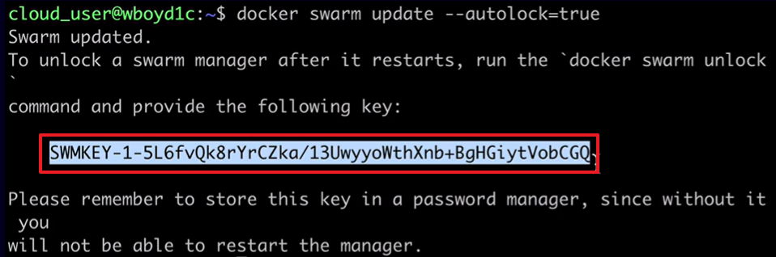
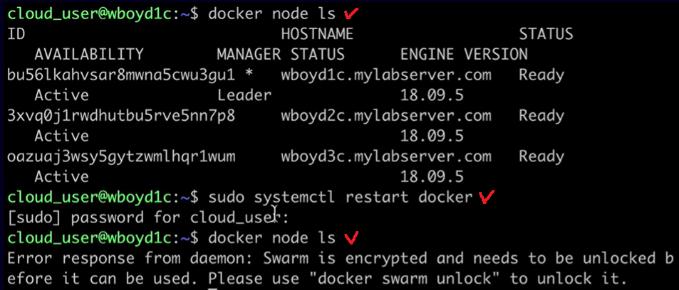

[Back to ACG DCA](../main.md)

# Locking and Unlocking a Swarm Cluster

### Concept) Autolock
- Docker supports the ability to securely store certain encryption keys. - These encryption keys are used to encrypt sensitive cluster data, but are stored unencrypted on the disks of swarm managers by default.
  - e.g.)
    - Raft logs on swarm managers
    - TLS communication between swarm nodes
 
**Autolock** allows for greater security for these keys, but requires each manager to be unlocked whenever Docker restarts. 
- [Documentation](https://docs.docker.com/engine/swarm/swarm_manager_locking/)


<br>

### Hands-on
#### Enable Autolock
  ```
  docker swarm update --autolock=true
  ```
  - Make sure to save the key provided when we enable Autolock.   
    
  - Once we've enabled Autolock, we cannot make swarm related commands until we unlock the swarm.
    - Experiment)   
      
      - If we ```docker node ls``` right after enabling Autolock, it works.
      - However, if we restart Docker, Autolock starts to work and blocks the swarm related commands.
      - Thus, we should unlock the swarm as below.

<br>

#### Unlock the swarm.
  ```
  docker swarm unlock
  ```
  - Enter the key that we saved above.
    - If you forgot the key, use the following command to get it.
      ```
      docker swarm unlock-key
      ```
    - Additionally, we can rotate (renew) the key.
      ```
      docker swarm unlock-key --rotate
      ```
      - cf.) Still, keep the old key. Some nodes might use it for a while...

<br>

#### Disable Autolock
  ```
  docker swarm update --autolock=false
  ```

<br>

<br><br>

[Back to ACG DCA](../main.md)