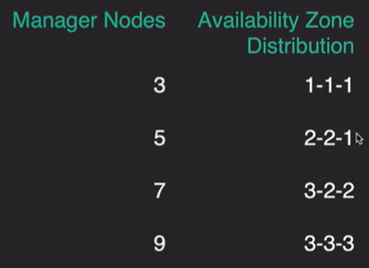

[Back to ACG DCA](../main.md)

# High Availability in a Swarm Cluster

 

### Concept) Raft Consensus Algorithm
- Desc.)
  - Docker uses the Raft consensus algorithm to maintain a consistent cluster state across multiple managers.
- [Documentation](https://docs.docker.com/engine/swarm/raft/)

 

### Concept) Quorum
- Def.)
  - A quorum is the majority of managers in a swarm.
- Props.)
  - A quorum must be maintained in order to make changes to the cluster state.
    - If a quorum is not available, nodes cannot be added or removed, new tasks cannot be added, and existing tasks cannot be changed or removed.
    - e.g.) Among 5 managers, we can make changes if at least 3 of them are functioning.
  - Recommended to have an odd number of managers.
    - why?) To maintain the "majority," i.e. more than half.

 

### Concept) Availability Zones
- Desc.)
  - Docker recommends that you distribute your manager nodes across at least 3 availability zones.
  - Distribute your managers across these zones so that you can maintain a quorum if one of them goes down.   
    

 

 

[Back to ACG DCA](../main.md)