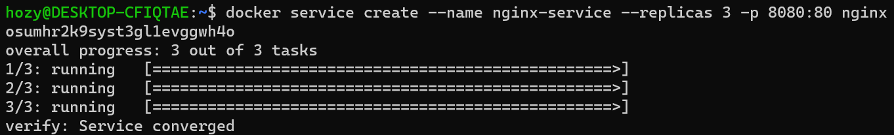
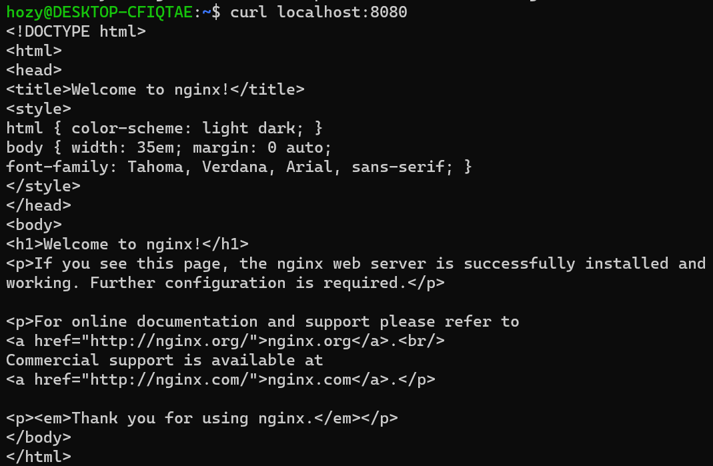
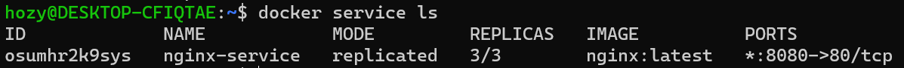
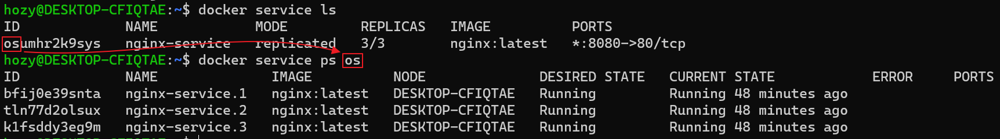
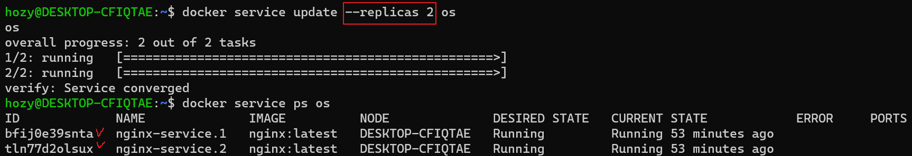
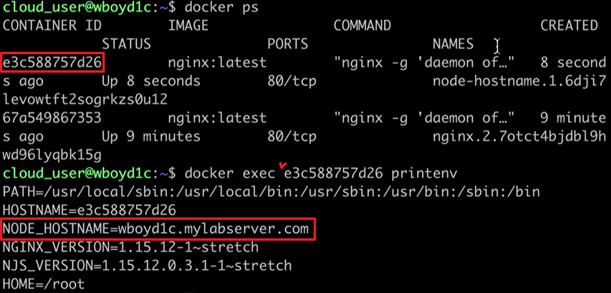

[Back to ACG DCA](../main.md)

# Docker Services

### Concept) Services
- Desc.)
  - A Service is used to run an application on a Docker Swarm.
  - A Service specifies a set of one or more replica tasks.
  - These tasks will be distributed automatically across the nodes in the cluster and executed as containers.
    - Consider tasks as containers
- Commands)
  - Create a service.
    ```
    docker service create [image_name]
    ```
    - e.g) An nginx service with three replicas and the port 8080:80.    
      
      - Test if the port is working properly.    
        
  - List the services.
    ```
    docker service ls
    ```
    
  - List the services' tasks
    ```
    docker service ps [service_id]
    ```
    
  - Get more information about a service.
    ```
    docker service inspect [service_id]
    ```
    - For a more organized visualization...
      ```
      docker service inspect --pretty [service_id]
      ```
  - Make changes to a service.
    ```
    docker service update [options] [service_id]
    ```
    - e.g.) Change the number of replicas.   
      
  - Delete a service.
    ```
    docker service rm [service_id]
    ```


<br>

#### Tech) Create a Service using a template
- Flags that are accepted
  - ```--hostname```
    - How to?)
      - Specify the hostname when creating a service, using the Go template.
        ```
        docker service create --name node-with-hostname --env NODE_HOSTNAME="{{.Node.Hostname}} --replicas 3 nginx
        ```
      - Check)
        - Get the id of the container.
        - Run ```docker exec [container_id] printenv``` command for the nginx.   
          
  - ```--mount```
    - For best performance and portability, you should avoid writing important data directly into a container's writable layer. You should instead use data volumes or bind mounts.
  - ```--env```
    - Configure environment variables
  - For more info check the [Documentation](https://docs.docker.com/engine/swarm/services/)


<br>

#### Concept) Replicated Service vs. Global Service
|Replicated Service|Global Service|
|:-|:-|
|Replicated Services run the requested number of replica tasks across the swarm cluster.|Global services run one task on each node in the cluster. <br> Initially generates three tasks for three nodes. <br> If nodes are added, the equal number of tasks will be added.|
|e.g.) <code>docker service create --replicas 3 nginx</code>|e.g.) <code>docker service create --mode global nginx</code>|


<br>

#### Concept) Scaling Services
- Recall that we scaled a service using the following command.
  ```
  docker service update --replicas [num_replicas] [service_id]
  ```
- Alternative way to do this.
  ```
  docker service scale [service_id]=[num_replicas]
  ```


<br>

[Back to ACG DCA](../main.md)