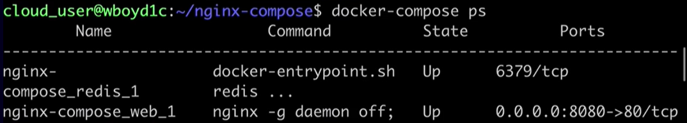

[Back to ACG DCA](../main.md)

# Docker Compose

### Concept) Multi-Container Application
An application that runs multiple containers with different images running different software interacting with each other.

<br>

### Concept) Docker Compose
Docker Compose is a tool that allows you to run multi-container applications defined using a declarative format.
- [Official Documentation](https://docs.docker.com/compose/)

#### Hands on)
- Install Docker Compose
  - Install the binary
    ```
    sudo curl -L "https://github.com/docker/compose/releases/download/1.24.0/  docker-compose-$(uname -s)-$(uname -m)" -o /usr/local/bin/docker-compose
    ```
  - Make the downloaded file executable.
    ```
    sudo chmod +x /usr/local/bin/docker-compose
    ```
  - Verify if Docker Compose is working properly.
    ```
    docker-compose version
    ```

- Create a Docker Compose Project.
  - Make a directory and go there.
    ```
    mkdir ~/nginx-compose && cd ~/nginx-compose
    ```
  - Create a yaml file. ```docker-compose.yml``` is the standard name.
    ```
    vim docker-compose.yml
    ```
    - Edit as follows. Simple application.
      ```
      version: '3'
      services:
        web:
            image: nginx
            ports:
            - "8080:80"
        redis:
            image: redis:alpine
      ```
      - Components
        - Web Server : nginx with 8080:80 port exposed.
        - Backend DB : redis:alpine
  - Run the project we created.
    ```
    docker-compose up -d
    ```
    - ```-d``` flag for the detached mode.
  - List the currently running containers.
    ```
    docker-compose ps
    ```
    
  - Stop and remove all resources that were created using ```docker-compose up```
    ```
    docker-compose down
    ``` 

<br>

<br>

[Back to ACG DCA](../main.md)