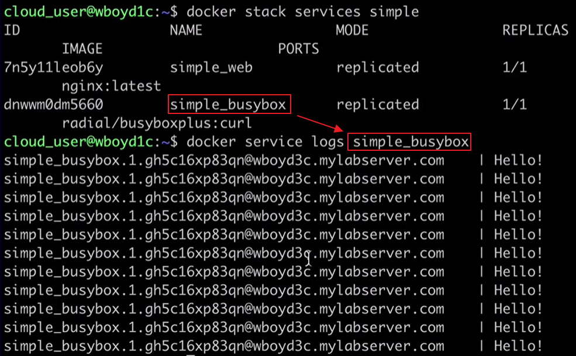

[Back to ACG DCA](../main.md)

# Docker Stacks

### Concept) Docker Stack
- Def.)
  - A Stack is a collection of interrelated services that can be deployed and scaled as a unit.
- Prop.)
  - Similar to [Docker Compose](../04_05/note.md#concept-docker-compose) as a multi-container application.
    - However, Docker Stacks can be scaled and executed across the swarm just like [normal swarm services](../02_08/note.md#concept-docker-swarm).
      - cf.) [Docker Services](../04_03/note.md#docker-services) are capable of running a **single** replicated application across the nodes. While, Docker Stacks can run **multiple** applications.

<br>

#### Hands on
- Create a Docker Stack compose file.
  ```
  vim [yaml_file_name].yml
  ```
  - Contents of the ```[yaml_file_name].yml``` file. 
    ```yaml
    version: '3'
    services:
        web:
            image: nginx
        busybox:
            image: radial/busyboxplus:curl
            command: /bin/sh -c "while true; do echo Hello! sleep 10; done"
    ```
    - Desc.)
      - nginx as a web server.
      - A busybox with ```radial/busyboxplus:curl``` image.
        - It runs a script with a loop that echoes "Hello!" and sleeps for 10 seconds.
    - For more techniques dealing with the compose yaml file, refer to  [Manipulating Stack Compose Yaml File](#tech-manipulating-stack-compose-yaml-file) below.
- Deploy a new Stack to the cluster using a compose file.
  ```
  docker stack deploy -c [yaml_file_name].yml [stack_name]
  ```
- List current stacks.
  ```
  docker stack ls
  ```
- List the tasks associated with the stack, ```[stack_name]```
  ```
  docker stack ps [stack_name]
  ```
- Check logs of a service in the stack.
  ```
  docker service logs [service_name_in_the_stack]
  ```
  - e.g.) Our yml had a busybox service.   
    
- Delete the stack.
  ```
  docker stack rm [stack_name]
  ```

<br>

#### Tech.) Manipulating Stack Compose Yaml File
- Using environment variable in the stack compose yaml file.
  ```yaml
  version: '3'
  services:
      web:
          image: nginx
      busybox:
          image: radial/busyboxplus:curl
          command: /bin/sh -c "while true; do echo $$MESSAGE! sleep 10; done"
          environment:
          - MESSAGE=Hello!
  ```
  - Desc.)
    - In this case, we used an environment variable ```$$MESSAGE``` instead of the string "Hello!".
    - To test the changed yaml file, we should deploy again.
- Exposing port for the ```nginx``` service
  ```yaml
  version: '3'
  services:
      web:
          image: nginx
          ports:
          - "8080:80"
      busybox:
          image: radial/busyboxplus:curl
          command: /bin/sh -c "while true; do echo $$MESSAGE!; sleep 10; done"
          environment:
          - MESSAGE=Hello!
  ```
  - Desc.)
    - Exposed the 8080:80 port for the nginx.
    - To test the changed yaml file, we should deploy again.
    - Test!
      ```
      curl localhost:8080
      ```
- Direct network between services.
  ```yaml
  version: '3'
  services:
      web:
          image: nginx
          ports:
          - "8080:80"
      busybox:
          image: radial/busyboxplus:curl
          command: /bin/sh -c "while true; curl web:80; sleep 10; done"
  ```
  - Desc.)
    - In this case, we added ```curl web:80``` command for the ```busybox``` service. 
    - It ```curl```s the service named ```web```, which is a nginx service.
    - Likewise, each services can directly call each other through their own network.
- How to scale services.
  ```yaml
  version: '3'
  services:
      web:
          image: nginx
          ports:
          - "8080:80"
          deploy:
            replicas: 3
      busybox:
          image: radial/busyboxplus:curl
          command: /bin/sh -c "while true; curl web:80; sleep 10; done"
  ```
  - Desc.)
    - This time, we added ```deploy: replicas: 3```.
    - It scales the ```web``` service to scale up to three replicas.
    - To test the changed yaml file, we should deploy again.
    - Test.
      ```
      docker stack ps [stack_name]
      ```

<br>

[Back to ACG DCA](../main.md)