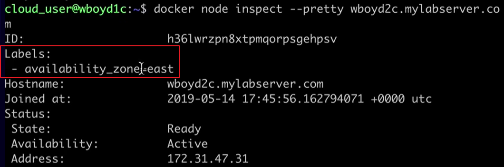

[Back to ACG DCA](../main.md)

# 4.7 Node Labels

### Concept) Node Label
- Def.)
  - A piece of metadata that can be added to nodes in Docker Swarm.
- Usage)
  - Can be used in a variety of ways.
  - This lesson focuses on using Node Labels to determine whether a node will be used or not for a certain task.

<br>

#### Hand on
- How to add label to a node
  ```
  docker node update --label-add [label_name][label_value] [target_node_name]
  ```
  - cf.) Recall that you can list nodes with ```docker node ls``` command.

- How to view existing node labels.
  ```
  docker node inspect --pretty [target_node_name]
  ```
  

- How to use labels to execute the tasks.
  - Create a service specifying the label constraint.
    - Syntax
      ```
      docker service create --constraint node.labels.[LABEL_CONDITION_TEXT] [IMAGE]
      ```
     - Here, ```[LABEL_CONDITION_TEXT]``` can be...
       - Equality : ```[LABEL_NAME]==[LABEL_VALUE]```
       - Not Equal : ```[LABEL_NAME]!=[LABEL_VALUE]```
     - e.g.) Create an nginx service with nodes which "availability_zone" label's value is "east."
       ```
       docker service create --name nginx-east --constraint node.labels.availability_zone==east --replicas 3 nginx
       ```
       - Meaning : Only the nodes that have labels "availability_zone" and their values are "east" will be used to create the service named "nginx-east."
       - Check.
         ```
         docker service ps nginx-east
         ```
     - e.g.) Create an nginx service with nodes which "availability_zone" label's value is not "east."
       ```
       docker service create --name nginx-west --constraint node.labels.availability_zone!=east --replicas 3 nginx
       ```
       - Meaning : Only the nodes that do not have labels "availability_zone" or have the labels "availability_zone" but their values are not "east" will be used to create the service named "nginx-west."
       - Check.
         ```
         docker service ps nginx-west
         ```
- Evenly balancing with ```--placement-pref``` option.
  - Functionality)
    - Spread tasks evenly across all values of a particular label.
  - Syntax
    ```
    docker service create --placement-pref spread=node.labels.[LABEL_NAME] [IMAGE]
    ```
  - e.g.)
    ```
    docker service create --name nginx-spread --placement-pref spread=node.label.availability_zone --replicas 3 nginx
    ```
    - This will evenly balance the node with each label values for "availability_zone" label.

<br>

cf.) Remove service after the test.
```
docker service rm [SERVICE_NAME]
```

<br>

[Back to ACG DCA](../main.md)