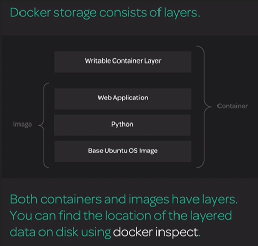

[Back to ACG DCA](../main.md)

# Docker Storage in Depth

### Concept) Storage Drivers (Graph Drivers)
- Choose a storage driver considering your OS and other local configuration factors.
- e.g)
  - **overlay2** for current Ubuntu and CentOS/RHEL versions
  - **aufs** for Ubuntu 14.04 and older
  - **devicemapper** for CentOS 7 and earlier

 

### Concept) Storage Models
- Persistent data can be managed using several storage models.
- Types
  - Filesystem Storage
    - Data is stored in the form of a file system
    - Used by overlay2 and aufs
    - Efficient use of memory
    - Inefficient with write heavy workloads
  - Block Storage
    - Stores data in blocks
    - Used by devicemapper
    - Efficient with write heavy workloads
  - Object Storage
    - Stores data in an external object-based store
      - e.g.) Rest API
    - Application must be designed to use object-based storage
    - Flexible and scalable

 

### Concept) Storage Layers

 

 

[Back to ACG DCA](../main.md)