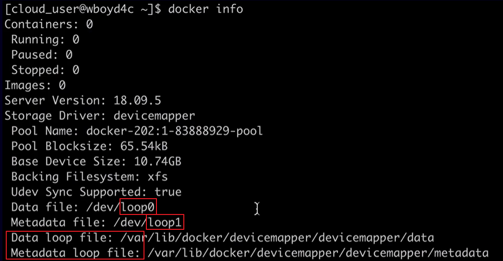

[Back to ACG DCA](../main.md)

# Configuring DeviceMapper

### Concept) Device Mapper
- Desc.)
  - One of [the Docker storage drivers](../05_01/note.md#concept-storage-drivers-graph-drivers) available for some Linux distributions.   
  - The default storage driver for CentOS 7 and earlier.
- How to customize)
  - Edit the ```daemon config files```.
- Two modes)
  1. loop-lvm mode (default)
     - Loopback mechanism simulates an additional physical disk using files on the  local disc.
       - cf.) [Block Storage devices](../05_01/note.md#concept-storage-models)  usually require additional physical disks.
         - loop-lvm simulates instead.
     - Minimal setup
       - Does not require an additional storage device.
     - Bad performance
       - Provides only the simulation, not the actual storage.
       - Use only for testing.
     - Check from the ```docker info``` output.   
       
  2. direct-lvm mode
     - Props)
       - Stores data on a separate device.
       - Requires an additional storage device.
       - Good performance
         - Used for production
     - How to set-up)
       - Settings)
         - When setting up a new CentOS server
           - Enable the option ```add/dev/xvdb``` : Adding a new storage device.
           - Install Docker
         - In case using an existing CentOS with an additional storage device...
           1. Disable and stop Docker.
              ```
              sudo systemctl disable docker
              sudo systemctl stop docker
              ```
           2. Delete all the docker data.
              ```
              sudo rm -rf /var/lib/docker
              ```
       - Configure DeviceMapper in ```daemon.json```.
         ```
         sudo vi /etc/docker/daemon.json
         ```
         - Add the following.
           ```
           {
               "storage-driver": "devicemapper",
               "storage-opts": [
                   "dm.directlvm_device=/dev/nvme1n1",
                   "dm.thinp_percent=95",
                   "dm.thinp_metapercent=1",
                   "dm.thinp_autoextend_threshold=80",
                   "dm.thinp_autoextend_percent=20",
                   "dm.directlvm_device_force=true"
               ]
           }
           ```
       - Start and enable Docker.
         ```
         sudo systemctl enable docker
         sudo systemctl start docker
         ```
       - . Check the storage driver information provided by ```docker info```.
         ```
         docker info
         ```


<br>

<br>

[Back to ACG DCA](../main.md)