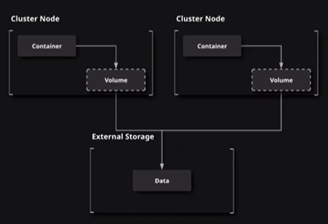
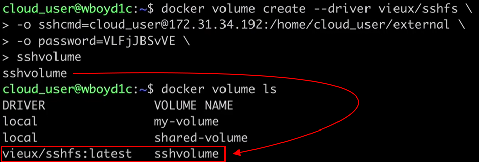
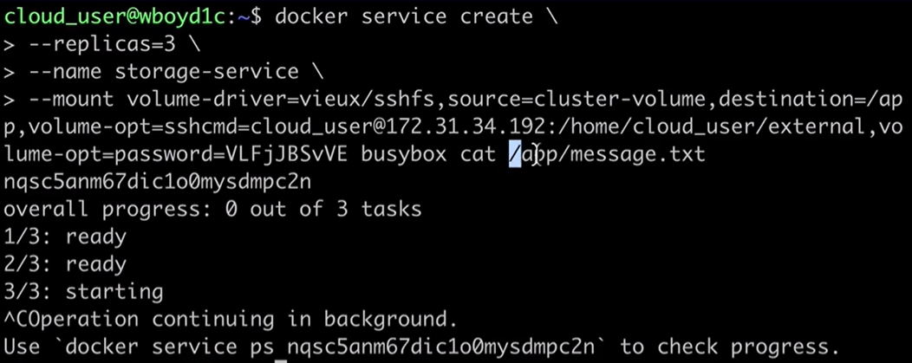
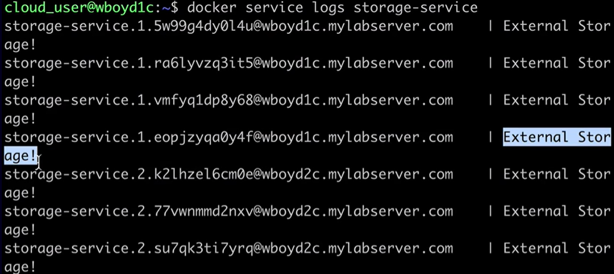

[Back to ACG DCA](../main.md)

# Storage in a Cluster

### Tech.) Storage in a Docker Swarm cluster
- Options)
  - Use application logic to store data in external object storage.
  - Use a [volume driver](#concept-volume-driver) to create a volume that is external to any specific machine in your cluster.

<br>

### Concept) Volume Driver   

- How to use this
  - Use sshfs plugin.
    - How to)
      - Install the ```sshfs``` plugin on the Swarm Manger.
        ```
        docker plugin install --grant-all-permissions vieux/sshfs
        ```
      - Install the ```sshfs``` plugin on the worker nodes as well with the same command.
        ```
        docker plugin install --grant-all-permissions vieux/sshfs
        ```
      - Prepare an extra server that will provide the actual storage to the Swarm.
        - In this case, an Ubuntu server is used.
        - Make a directory and move to it.
          ```
          mkdir /home/cloud_user/external && cd external
          ```
        - Create a test file.
          ```
          echo External Storage! > /home/cloud_user/external/message.txt
          ```
      - Two ways to set up the external server as the volume for the cluster.
        1. (**NOT Recommended**) Go back to the Swarm manger and activate the above storage as a Volume Driver.
           ```
           docker volume create --driver vieux/sshfs \
           -o sshcmd=[USER_NAME]@[EXTERNAL_SERVER_PRIVATE_IP_ADDRESS]:[SPECIFIED  DIRECTORY] \
           -o password=[EXTERNAL_SERVER_PASSWORD] \
           [NEW_NAME_OF_THE_VOLUME]
           ```
           
           - Problem)
              - This volume is set up ONLY for the master node.
              - Thus, if you create a docker service and it happens to be running on a worker node, it may create a new standard volume with the same node that you provided, not using the existing external volume.
        2. (**Recommended**) When creating a service, create a volume driver.
           ```
           docker service create \
           --replicas=[NUMBER_OF_REPS] \
           --name [NAME_OF_THE_SERVICE] \
           -- mount volume-driver=vieux/sshfs,source=[VOLUME_NAME],destination=/app,volume-opt=sshcmd=[USER_NAME]@[EXTERNAL_SERVER_PRIVATE_IP_ADDRESS]:[SPECIFIED  DIRECTORY],volume-opt=password=[EXTERNAL_SERVER_PASSWORD] [SERVICE_CONTAINER] [COMMAND_FOR_THE_SERVICE]
           ```
           
           - Check logs and see if the ```busybox``` containers ```cat``` properly.   
             
  - There are many ways to do this other than ```sshfs```.


<br>

<br>

[Back to ACG DCA](../main.md)