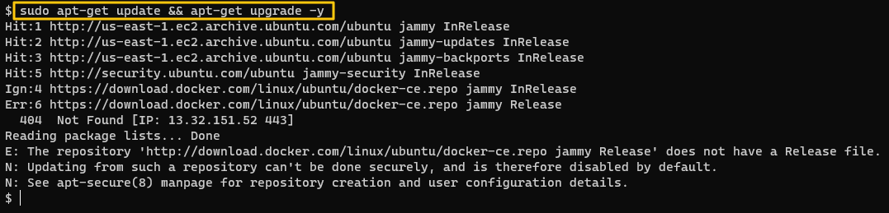
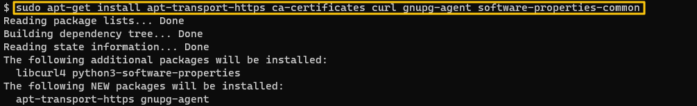
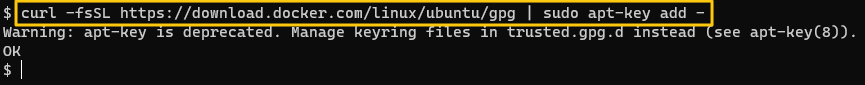
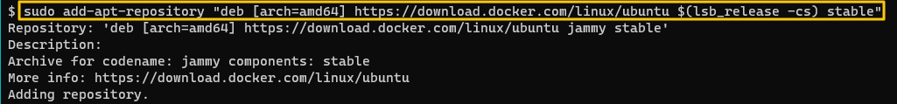
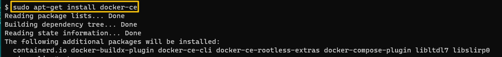
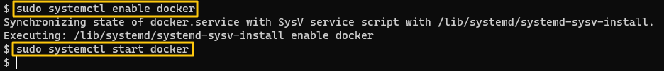
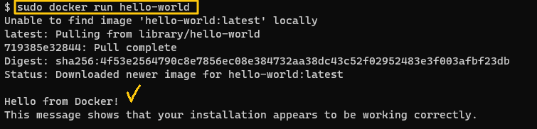
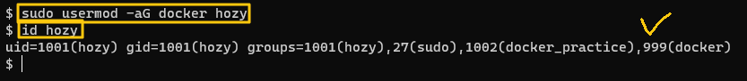
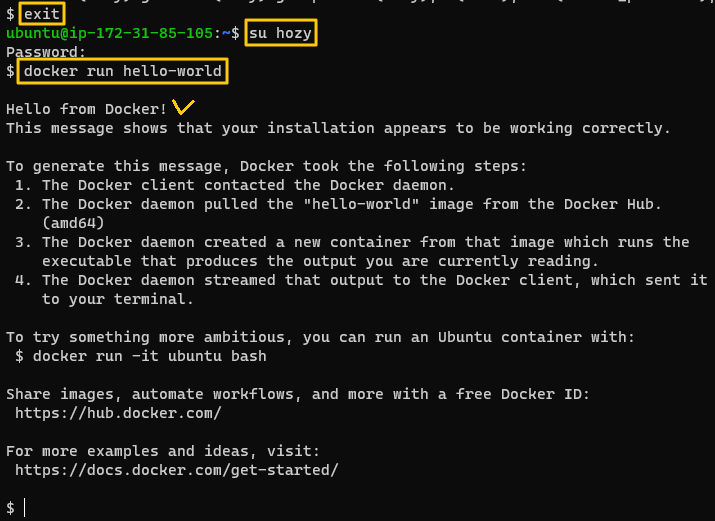

[Back to ACG Docker Quick Start](../main.md)

# Installation and Configurations

## 1. Script using installation
```
wget -q https://get.docker.com | sh
```

<br>

## 2. Step by Step Installation
Installing in Ubuntu

#### Update apt and upgrade packages.
```
sudo apt-get update && sudo apt-get upgrade -y
```


<br>

#### Install packages that are needed.
```
sudo apt-get -y install apt-transport-https ca-certificates curl gnupg-agent software-properties-common
```


<br>

#### Add Docker Official GPG key
```
curl -fsSL https://download.docker.com/linux/ubuntu/gpg | sudo apt-key add -
```


<br>

#### Add repository
```
sudo add-apt-repository "deb [arch=amd64] https://download.docker.com/linux/ubuntu $(lsb_release -cs) stable"
```


<br>

#### Install Docker Community Edition
```
sudo apt-get install docker-ce
```


<br>

#### Enable and start docker
```
sudo systemctl enable docker
```
```
sudo systemctl start docker
```


<br>

#### Run hello-world image for test
Docker automatically pulls the image, *hello-world*.
```
sudo docker run hello-world
```


<br>

#### Add user to the docker group so that we may not use "sudo ~" command anymore
   

* Exit from and re log-into the target user. And try docker run.   
   


<br>

[Back to ACG Docker Quick Start](../main.md)