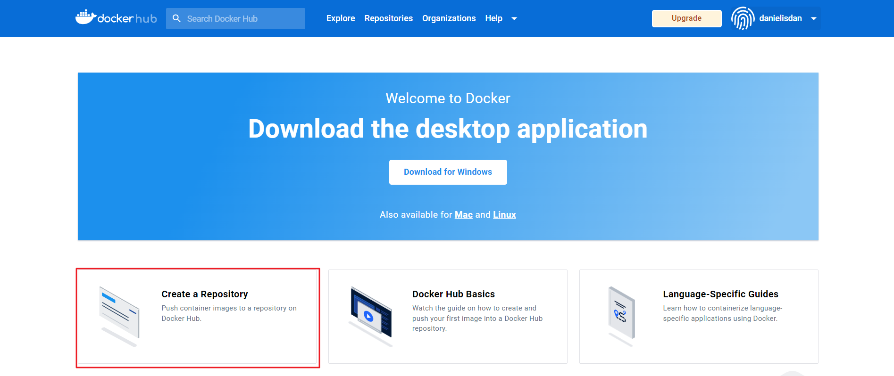

[Back to ACG Docker Quick Start](../main.md)

# Docker Hub

### What is Docker Hub?
* Images are held in Docker Hub
* Refer to [Image & Container Management](../06/note.md) for image pushing and pulling to Docker Hub
* Website : https://hub.docker.com/

 

### How to create a repository

[Back to ACG Docker Quick Start](../main.md)