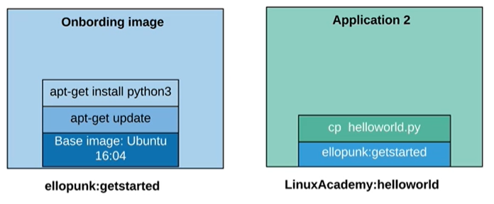
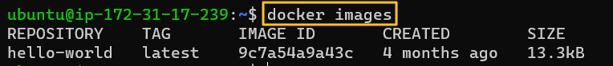
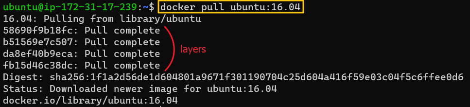
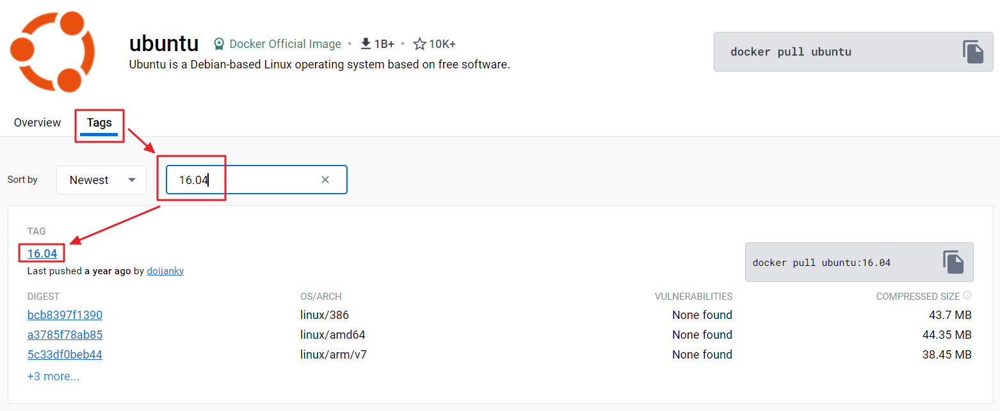
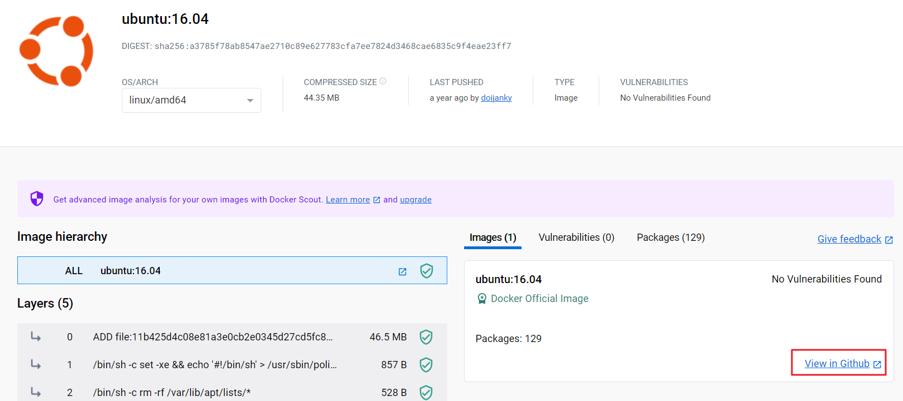
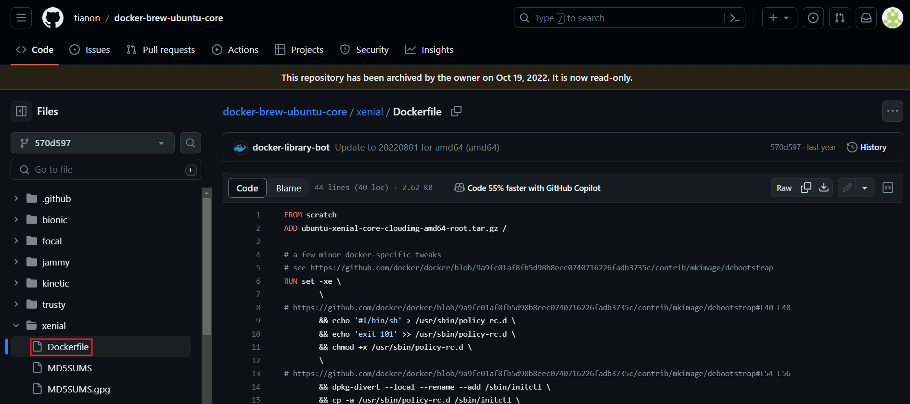

[Back to ACG Docker Quick Start](../main.md)

# Docker Image

### Why this needed?
Consider the following scenario.
* Suppose a new worker came.
* Rather than making him install all the environments, we can provide a image that every packages are already installed.
* So, build an onboarding image.
* And make him pull down the image.
* And let him test the existing script.



<br>

### Hands-on : Image related
View images
```
docker image ls
docker images
```
* Both works   
  

<br>

If you pull down ubuntu:16.04, there are layers of images that are automatically pulled as well.
* These are configured in the dockerfile.
  

* How to check the dockerfile? 
  * Go to Docker Hub
       
       
       

Run image.
```
docker run <image_name>
docker run <image_id>
```
* cf.) The full IMAGE ID is in SHA256 hash format
  

<br>

[Back to ACG Docker Quick Start](../main.md)