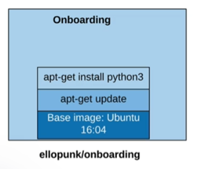
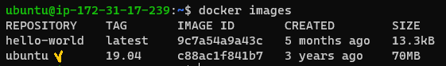
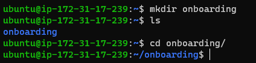
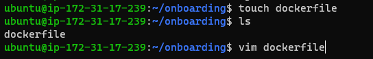
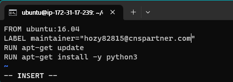
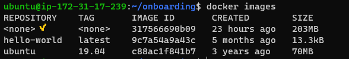

[Back to ACG Docker Quick Start](../main.md)

# Dockerfile

### Hands on : Create a dockerfile
* Objective
  * Create a Dockerfile in onboarding directory.   
    

<br>

Base image should be installed in advance.


<br>

Create onboarding directory and go there.   


<br>

Create dockerfile and edit it with vim.   


* Contents
  1. Base image : ubuntu:16.04
  2. maintainer information
  3. apt-get update
  4. apt-get install python3 with all answers yes!

<br>

Build docker in the current directory, using the dockerfile that we created!
* Dockerfile, which is a build context, will be sent to Docker Daemon and the image creation process will begin.
  ```
  docker build <docker_file_located_dir>
  ```
  

<br>

Check the image.   


<br>

[Back to ACG Docker Quick Start](../main.md)