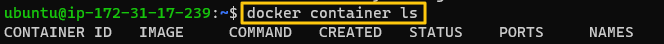
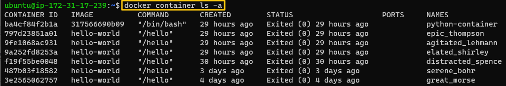
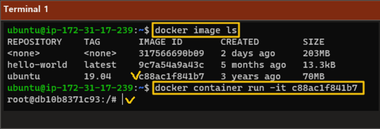
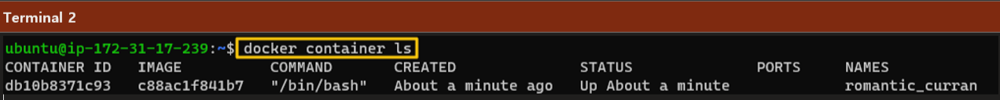
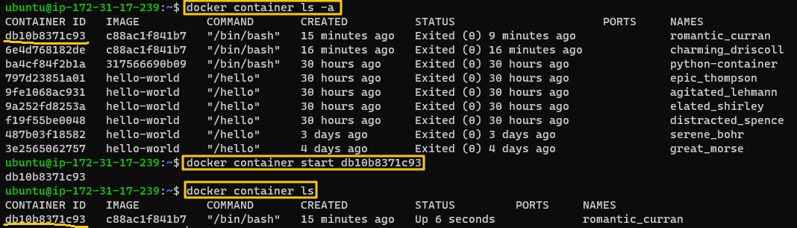
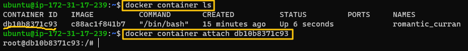
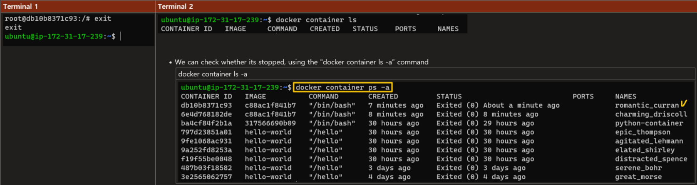

[Back to ACG Docker Quick Start](../main.md)

# Container Lifecycle

### Three Status of a container
1. Start
2. Running
3. Stop

<br>

### Container Commands
|Command|Meaning|Demonstration|
|-|-|-|
|``` docker container ls ```|Show the currently running containers.||
|``` docker container ls -a ```|Show all containers including the ones that are running and are stopped.||
|``` docker container run <image_id> ```|Start a new container. But it will immediately be stopped.||
||||
|``` docker container start <container_id> ```|Start a currently stopped container.||
|``` docker container attach <container_id> ```|Attach to the container that is running.||
|``` (attached_to_a_container)# exit ```|Stop the container.||


[Back to ACG Docker Quick Start](../main.md)