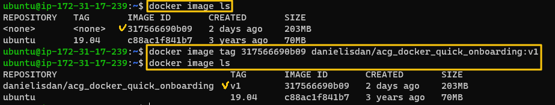

[Back to ACG Docker Quick Start](../main.md)

# Image & Container Management

### How to remove a container that is stopped.
```
docker container rm <container_id_or_name>
```


<br>

### How to remove an image.
```
docker image rmi <image_id>
```

* What if we want to save the image before we remove?
  * Push the image to the dockerhub!

<br>

### Push an image to Docker Hub.
1. Create a repository at Docker Hub
   
2. Log in to Docker Hub
   
3. Tag the image
   ```
   docker image tag <image_id> <repo_namespace>/<repo_name2>:<tag>
   ```
   
4. Push the image
   ```
   docker image push <repository_name>:<tag>
   ```
   
   * Check result in Docker Hub   
    
5. Pull the image from the Docker Hub
   


<br>

[Back to ACG Docker Quick Start](../main.md)