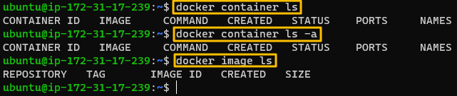
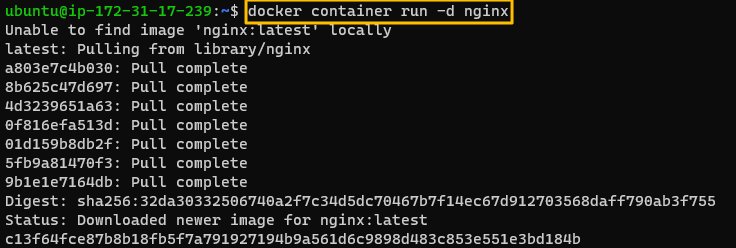
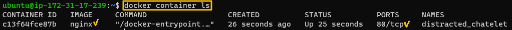
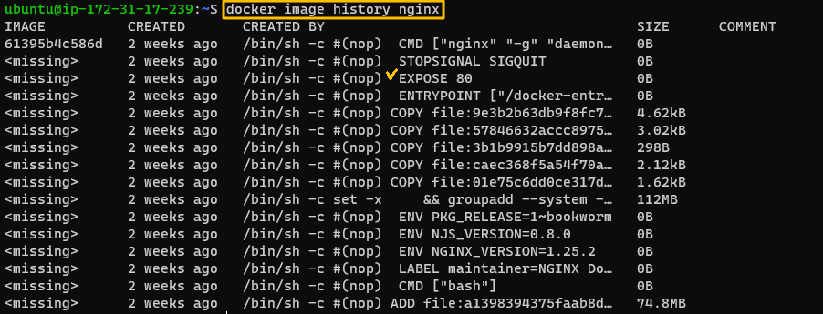
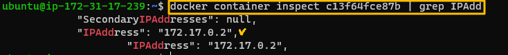
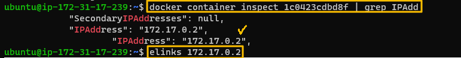
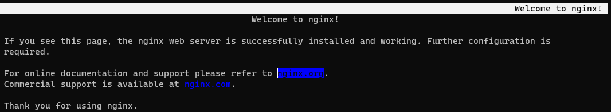
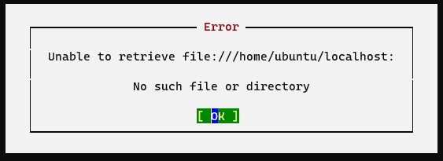
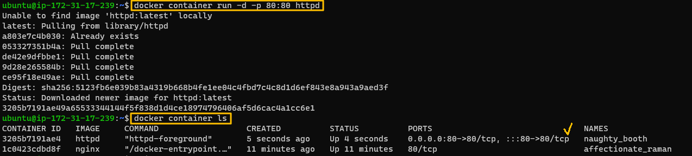

[Back to ACG Docker Quick Start](../main.md)

# Docker Container Port

### Hands on
* Objective
  * Access to the container from the local host.

<br>

Check containers. No image and no container.   


<br>

Install and run nginx container.    
    
   
* The port 80 is exposed so we can access this container using programs like elinks.
* This was done by nginx image and can be found using "docker image history" command.
  

<br>

Figure out the IP address of the nginx container.
```
docker container inspect <container_id> | grep IPAdd
```


<br>

Connect to the IP address of that container using elinks
   
   
* However, if you try to connect to the localhost, it does not work.
       
       
  * Why not?
    * Out local host is not listening to the local port of 80 that nginx is using.

<br>

If we run apache2 with -P option, we can publish a container's port(s) to the host.
```
docker container run -d -p <host's port>:<container's port> httpd
```



<br>

[Back to ACG Docker Quick Start](../main.md)