[Back to ACG Docker Quick Start](../main.md)

# Docker Container Volume
#### Def.)
Preferred mechanism of persisting data generated by a container or generated to be used by a container

#### Advantage)
* Can be used in multiple containers
* Can be stored in a remote host or a cloud provider
* New volumes can have their content prepopulated by a container.


<br>

### Hands-on
* Check that no container is running and the following three images are installed.
  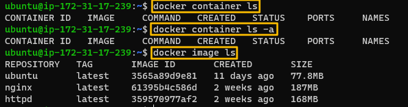

<br>

* Check if a volume exits
    ```
    docker volume ls
    ```
  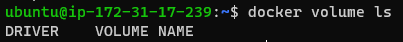

<br>

* Create a volume.
  ```
  docker volume create <volume_name>
  ```
  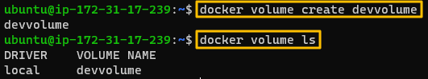

<br>

* Create the volume's info.
  ```
  docker volume inspect <volume_name>
  ```
  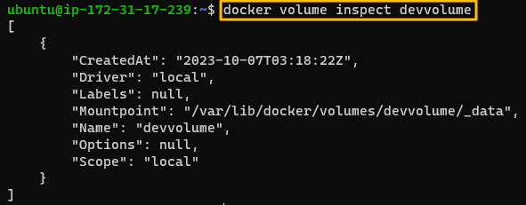
  * At local, check the directory that the docker volume is actually located at.
    ```
    sudo ls /var/lib/docker/volumes/<volume_name>
    ```
    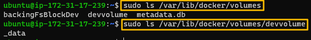

<br>

* Create a container and mount the volume to it.
* Use either --mount or -v
  * --mount
    ```
    docker container run -d --name <container_name> --mount source=<volume_name>,target=<destination_in_container> <image_name>
    ```
    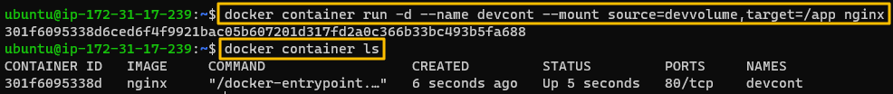
  * -v
    ```
    docker container run -d --name <container_name> -v <volume_name>:<destination_in_container> <image_name>
    ```
    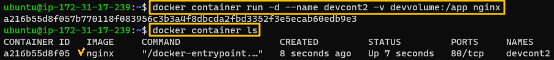

<br>

* Check if the volume is properly mounted to the container.
  ```
  docker container inspect <container_name>
  ```
  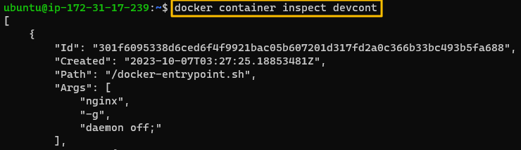   
  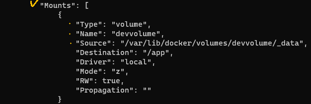   

<br><br>

### Experiment
Let's create some data in the volume using the containe
#### Settings
* Container : nginx
  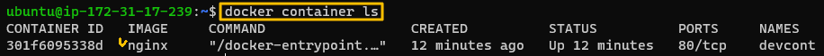
* Volume : devvolume
  * Mounted to nginx
  * Destination : /app   
  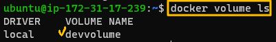   
     
     

#### Hands on
* Execute nginx, attach to it, and create a file in the destination directory!
  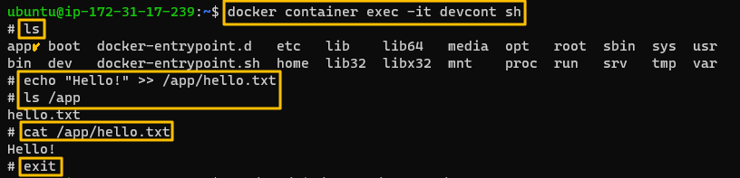
* Check the volume in local.
  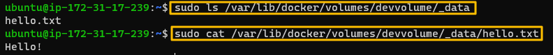
* Stop and remove the container and check if the volume still exists.
  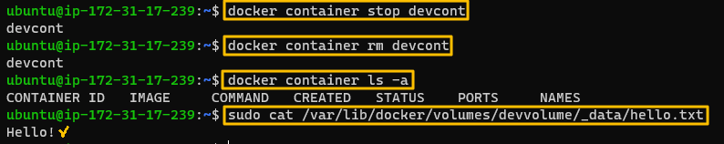
* Start a new container, mount the volume to it.
  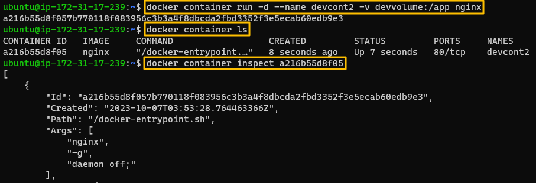   
  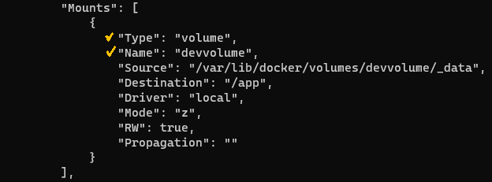   
* Check if its readable in the new container.
  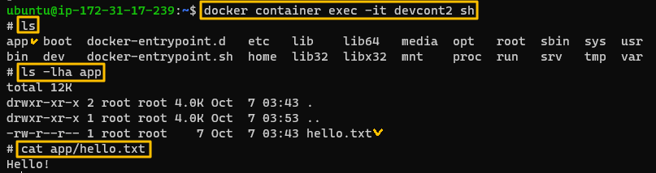   
* Modify the file and check it in the local.
  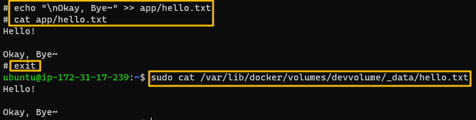   


<br>


[Back to ACG Docker Quick Start](../main.md)