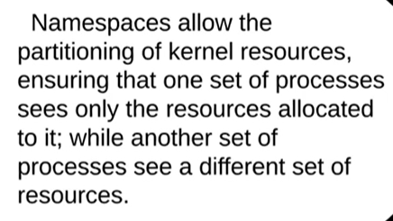
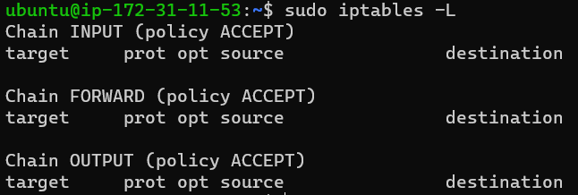
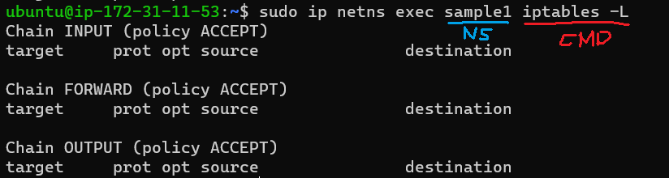
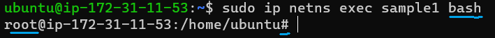
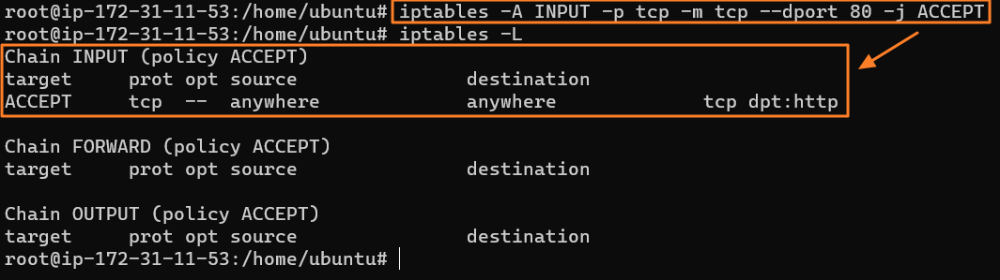
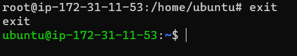
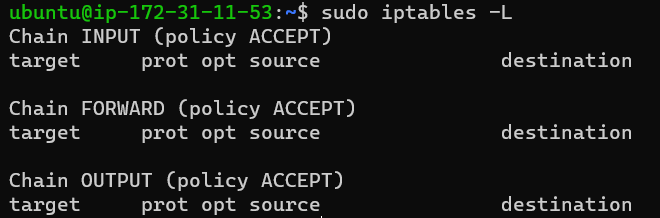

## Namespaces in Linux
Limits the ability of the process to see the system resource
#### Description)
  * Similar to global system wrap
  * Takes the global resources
  * Provides a wrapper around it which makes it look to the process in that namespace
    * Works like an isolated instance of that resource

#### Types of Namespaces
* User
  * A key security feature
  * Isolates security related identifiers.
    * Each namespaces can be given its own distinct set of UIDs and GUIDs.
  * Enables nested virtualization
    * ex) PID $n$ can be used in nested way.
    * ex) [Host PID 5000] <- [VM PID 5000] <- [Container PID 1]
      * High <- Low
      * Process with the lower hierarchy cannot access the one with the higher hierarchy.
* IPC (Inter Process Communication)
  * Isolates system resources from a process
  * Gives processes created in an IPC namespace visibility to each other 
    * Offers multiple processes to exchange data
      * Creates separate message queue for each namespace
      * Allows containers to send and receive messages
      * Guaranteeing the isolation and security
* UTS (Unix Time Sharing)
  * Allows a single system to appear to have a different host and domain names to different process.
  * Allows containers to have their own name
  * Containers can share the share the applications that have the host name as the default identifier
* Mount Namespace
  * Controls the mount points that are visible to each container
  * Provides isolated mounting spaces for each containers
  * Related to the file system
* PID
  * Provides processes with an independent set of process IDs.
  * e.g.) PID 1 : The root of that process tree
* Network
  * Virtualizes the network stack
  * Allows each container to have own copy of the network stack
    * Own routing tables
    * Own firewall rules
    * Own network devices
  * Hands on
    * Add a network namespace and check   
      
    * Add commands to the network namespace   
      * Check ip table rules
        
      * Execute sample 1 in the namespace. No command in it yet.
        
      * Go into sample1 NS using bash shell
        
      * Add a rule that allows http access and check the result
        
      * Go back out of the name space
        
    * Cannot find the rule that we set inside the NS
      * Container did not affect our host.
        

### Cgroups
Limits the ability of the process to access the system resource.   
For more description check [the next note](./2_3_cgroups.md).

