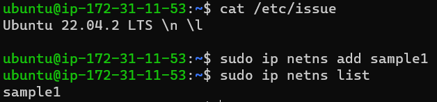

* Concept) Namespace   

* Description)
  * Similar to global system wrap
  * Takes the global resources
  * Provides a wrapper around it which makes it look to the process in that namespace
    * Works like an isolated instance of that resource

 

* Namespaces in Linux
  * Namespaces
    * Limits the ability of the process to see the system resource
  * Cgroups
    * Limits the ability of the process to access the system resource