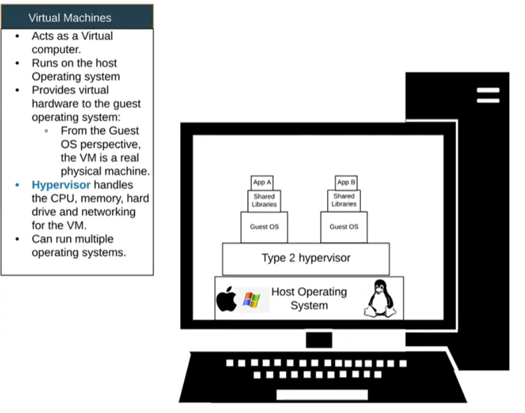
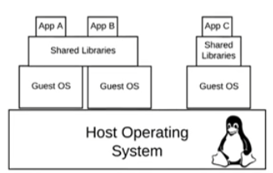

## Virtulaization
### Why needed?
Containers are the light versions of OS virtualized version.

 

### Architecture

#### Hypervisor
* Function
  * Provides virtual HW to guest OS
* Types
  * Type 1
    * Runs directly on the system hardware
    * Bare-metal hypervisor
  * Type 2
    * Runs on a host operating system that provides virtualization services.
    * SW based hypervisor

  

## LXC (Linux Container)
* Lets users create and manage system or application containers.
  * Chroot
  * Kernel Namespaces
  * SELinux / Apparmor
  * Seccomp policies
* Prop.)
  * Middle ground of fully-chrooted environment and a full virtual machine environment
  * Sharing the same Linux kernel

* [Installation Hands on with LXD](./3_3_lxc_lxd_hands_on.md)

  

## LXD (Linux Daemon)
A daemon that allows us to communicate with LXC