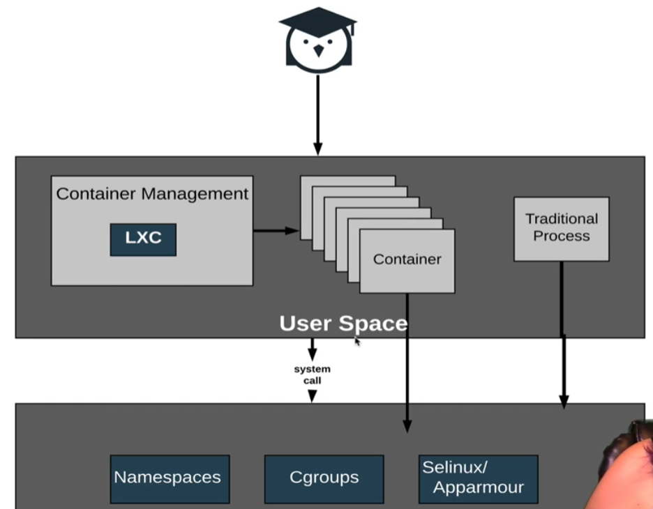

## Container Workflow
#### Review of the history of technology
1. [chroot](./2_1_chroot.md)
    * Enabled changing the root directory
2. [namespaces](./2_2_linux_namespaces.md)
    * Enabled partitioning the kernel resources.
    * Ensured that each set of processes sees only the resources allocated to it
3. [Cgroups](./2_3_cgroups.md)
    * Enabled isolating each set of processes with regard to resource usage
4. [OS level virtualization](./3_1_virtualization_lxc.md)
    * Enabled the instant creation of the isolated environments

 

#### Architecture

* SELinux (Security-Enhanced Linux)
  * Provides a mechanism for supporting access control polices
  * A kernel modification and userspace tool that limits the privileges a process has to the minimum required to work
* App Armor
  * A Linux kernel security module that allows users to restrict a program's capabilities using profiles.
  * Available in SUSE Linux enterprise servers and Debian based platforms.

 

#### Advantage of using containers
Allows us to create new isolated environment with less resources consumed compared to VMs.