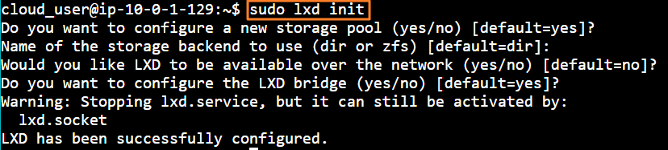
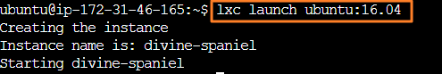

# Installing and Basic Usage of LXC/LXD

### Installing LXC/LXD.
* Determine our OS.   
  
* Install lxd (but already installed in Ubuntu)   
  
    * When tried with Ubuntu 22, the command was different
	  ```
      sudo apt install lxd-installer
      ```

<br>

### Initialize lxd   
  

<br>

### Container 1 : alpine
* Launch an alpine image with an alias "my-alpine"   
  
* Check my-alpine using lxc list   
  
* Create hello.txt file in my-alpine. Since alpine is compact, it does not support bash. Use ash instead.   
  

<br>

### Container 2 : Ubuntu
* Launch an Ubuntu image      
  
  * Default alias of "divine-spaniel" is assigned
* Again list and check the images      
  
* remote list command provides more details      
  
* Run ls command in divine-spaniel but cannot find hello.txt   
  
