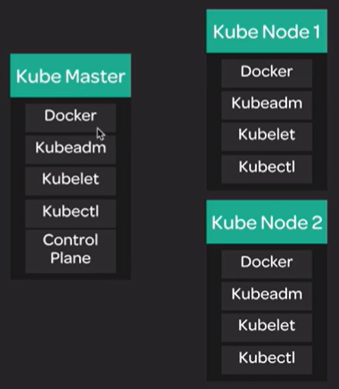

[Back to ACG K8s Essentials](../main.md)

# Cluster Architecture

* Docker
  * Container Runtime for this architecture
* Kubeadm
  * A tool that simplifies the K8s settings
  * Automates many jobs
* Kubelet
  * An agent that manages the cluster
* Kubectl
  * A command line tool that allows us to interact with the cluster
* Control Plane
  * A series of different services that forms the K8s Master's structure allowing it to control the cluster
  * Only in Master Node

 

[Back to ACG K8s Essentials](../main.md)