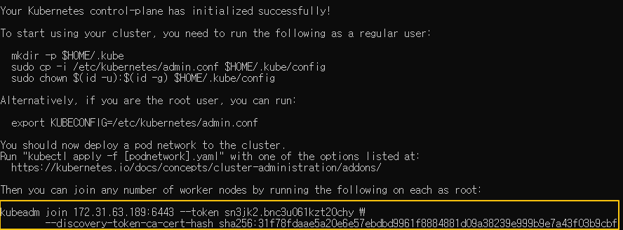

[Back to ACG K8s Essentials](../main.md)

# Bootstrapping the Cluster

## MASTER ONLY!
#### On the Kube master node, initialize the cluster:
```
sudo kubeadm init --pod-network-cidr 192.168.0.0/16 --kubernetes-version 1.24.0
```

#### Set kubectl access:
```
mkdir -p $HOME/.kube
```
```
sudo cp -i /etc/kubernetes/admin.conf $HOME/.kube/config
```
```
sudo chown $(id -u):$(id -g) $HOME/.kube/config
```

#### The kubeadm init command should output a kubeadm join command containing a token and hash. Copy that command and run it with sudo on both worker nodes. It should look something like this:

* Use can print the full 'kubeadm join' flag needed to join the cluster with the following command:
    ```
    kubeadm token create --print-join-command
    ```
---


<br>

<br>

[Back to ACG K8s Essentials](../main.md)