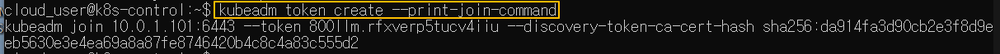
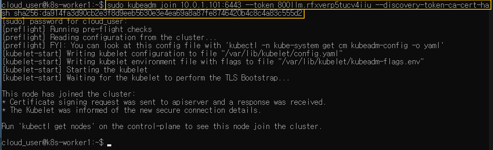

[Back to ACG K8s Essentials](../main.md)

# Joining the Worker Nodes

## WORKER NODE ONLY!
#### Run the kubeadm join command on your Kube Node 1 and Kube Node 2 servers:
- The join command can be obtained in the Master node with the following command.
  ```
  kubeadm token create --print-join-command
  ```
  
- Run the above join command on the Worker node.
  

#### From your Kube Master node, verify that all nodes have successfully joined the cluster:
```
kubectl get nodes
```

#### You should see all three of your nodes listed. It should look something like this:

|NAME                           |STATUS     |ROLES           |AGE    |VERSION|
|:------------------------------|:---------:|:--------------:|:-----:|:-----:|
|f8bbdd78c31c.mylabserver.com   |NotReady   |control-plane   |112s   |v1.24.0|
|f8bbdd78c32c.mylabserver.com   |NotReady   |<none>          |55s    |v1.24.0|
|f8bbdd78c33c.mylabserver.com   |NotReady   |<none>          |39s    |v1.24.0|

* *Note: The nodes are expected to have a STATUS of NotReady at this point

<br>

[Back to ACG K8s Essentials](../main.md)