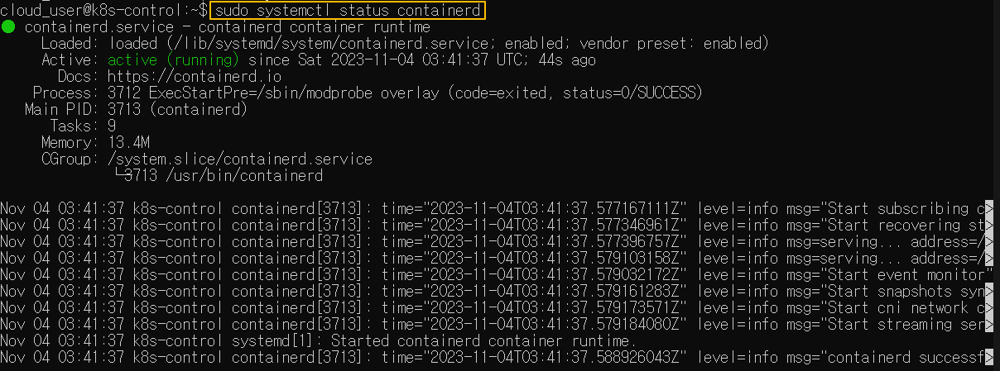
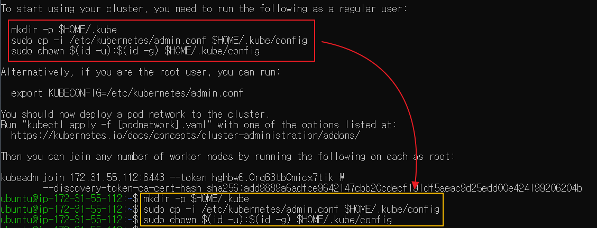
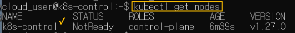
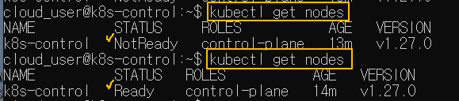
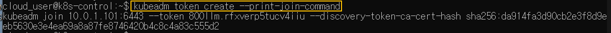
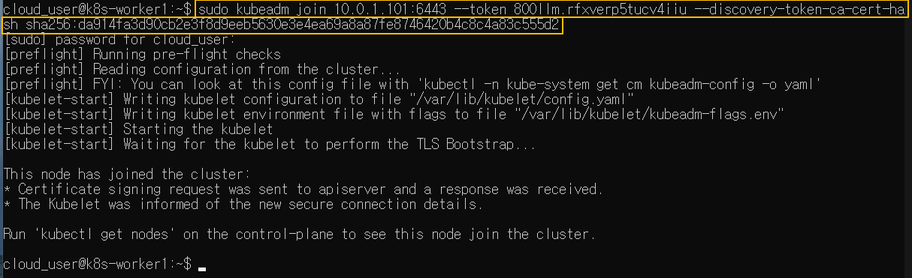
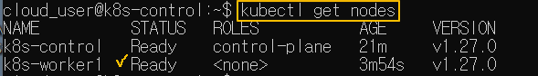

[Back to ACG K8s Essentials](../main.md)

# Building a Kubernetes 1.27 Cluster with kubeadm

## Objective
- Install Packages
- Initialize the Cluster
- Install the Calico Network Add-On
- Join the Worker Nodes to the Cluster

<br>

## Hands on

Install *containerd* and *kubebernetes* packages both on the Control Plane(the Master) and the Worker Node.

#### 1. Install containerd in both control plane and the worker node.
- Enable kernel modules, *overlay* and *br_netfilter*, to be loaded whenever the server starts.
  ```
  cat <<EOF | sudo tee /etc/modules-load.d/containerd.conf
  overlay
  br_netfilter
  EOF
  ```
  - Enable *overlay* and *br_netfilter* immediately without the server restart.
    ```
    sudo modprobe overlay
    ```
    ```
    sudo modprobe br_netfilter
    ```
- Configurations needed for the kubernetes networking.
  ```
  cat <<EOF | sudo tee /etc/sysctl.d/99-kubernetes-cri.conf
  net.bridge.bridge-nf-call-iptables = 1
  net.ipv4.ip_forward = 1
  net.bridge.bridge-nf-call-ip6tables = 1
  EOF
  ```
  - Enable the above settings immediately.
    ```
    sudo sysctl --system
    ```
- Install *containerd*.
  ```
  sudo apt-get update && sudo apt-get install -y containerd
  ```
- Setup the *containerd* configuration file.
  - Create a directory as follows:
    ```
    sudo mkdir -p /etc/containerd
    ```
  - Create the config file.
    ```
    sudo containerd config default | sudo tee /etc/containerd/config.toml
    ```
  - Restart *containerd* to make sure that *containerd* uses the above config file.
    ```
    sudo systemctl restart containerd
    ```
  - Check if *containerd* is running.
    ```
    sudo systemctl status containerd
    ```
    

<br>

#### 2. Install Kubernetes packages
- Disable swap
  ```
  sudo swapoff -a
  ```
- Install packages that might be needed during the installation process (Recommended in the k8s documentation.)
  ```
  sudo apt-get update && sudo apt-get install -y apt-transport-https curl etcd
  ```
  - Packages
    - apt-transport-https
    - curl
    - etcd
- Download the gpg key for the k8s package repository so that we can locate the k8s packages. and add it.
  ```
  curl -s https://packages.cloud.google.com/apt/doc/apt-key.gpg | sudo apt-key add -
  ```
- Set up repository configuration
  ```
  cat <<EOF | sudo tee /etc/apt/sources.list.d/kubernetes.list
  deb https://apt.kubernetes.io/ kubernetes-xenial main
  EOF
  ```
  - The second line is the reference to the kubernetes repository.
- Update the local package listings.
  ```
  sudo apt-get update
  ```
- Install *kubelet, kubeadm, kubectl*
  ```
  sudo apt-get install -y kubelet=1.27.0-00 kubeadm=1.27.0-00 kubectl=1.27.0-00
  ```
  - Ensure that the version numbers are all the same!
- Disable automatic update of the above three packages.
  ```
  sudo apt-mark hold kubelet kubeadm kubectl
  ```

<br>

#### 3. Initialize the cluster (ONLY FOR the Control Plane)
- Initialize the cluster using *kubeadm*
  ```
  sudo kubeadm init --pod-network-cidr 192.168.0.0/16 --kubernetes-version 1.27.0
  ```
  - Explanation
    - 192.168.0.0/16 is the ip-range that will be used for our virtual pod network.
    - *Calico* requires this setting.
  - If something goes wrong during this, check the log, fix the problem, and reset kubeadm with the following command.
    ```
    sudo kubeadm reset
    ```
- Set up the kube config to interact with the cluster using *kubectl*.
  - Use the output from the previous *kubeadm init* command.   
    
- Check if the *kubectl* is properly working.
  ```
  kubectl get nodes
  ```
  
  - The control plane is *NotReady* because no network-plugin for this cluster is installed yet.
  - We will install *Calico*.

<br>

#### 4. Install the Calico Network Add-On (ONLY FOR the Control Plane)
- Pass the manifest file to kubectl.
  ```
  kubectl apply -f https://docs.projectcalico.org/manifests/calico.yaml
  ```
- Check the cluster once again and the control plane will be changed in a couple of minutes.
  ```
  kubectl get nodes
  ```
  

<br>

#### 5. Join the Worker node to the cluster (ONLY FOR the Worker node)
- Get the join command from the control plane.
  ```
  kubeadm token create --print-join-command
  ```
  
- Run the above join command with **root(sudo)**!   
  
- Check the worker node in the control plane.
  ```
  kubectl get nodes
  ```
  


[Back to ACG K8s Essentials](../main.md)