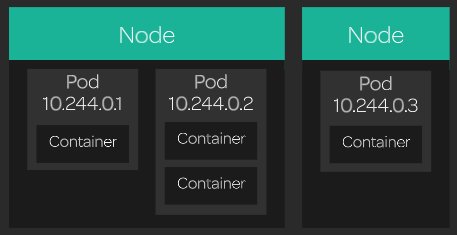

[Back to ACG K8s Essentials](../main.md)

# Containers and Pods

### Concept) Pods
The smallest and most basic building block of the Kubernetes model.
- Props.)
  - A pod consists of one or more containers, storage resources, and a unique IP address in the k8s cluster network.
  - In order to run containers, k8s **schedules** pods to run on servers in the cluster.
    - When a pod is scheduled, the server will run the containers that are part of that pod.



<br>

### Hands on
* Create a simple pod running an nginx container.
  ```
  cat << EOF | kubectl create -f -
  apiVersion: v1
  kind: Pod
  metadata:
    name: nginx
  spec:
    containers:
    - name: nginx
    image: nginx
  EOF
  ```
* Get a list of pods and verify that your new nginx pod is in the Running state.
  ```
  kubectl get pods
  ```
  - cf. Check all the pods in the k8s namespaces including the backend system pods.
    ```
    kubectl get pods -n kube-system
    ```
    ```
    kubectl get pods --all-namespaces
    ```
* Get more information about your nginx pod:
  ```
  kubectl describe pod nginx
  ``````

* Delete the pod:
  ```
  kubectl delete pod nginx
  ```

<br>

[Back to ACG K8s Essentials](../main.md)