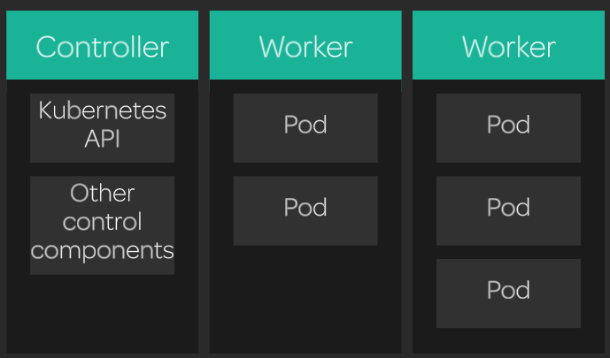

[Back to ACG K8s Essentials](../main.md)

# Clustering and Nodes

### Concept) Node
A container run by a server that consists a K8s cluster.

<br>

### Concept) Control Server (Master Node)
- A node that manage and control the k8s cluster and host the k8s API.
- Control servers are usually separate from worker nodes.
  
- Commands
  - Get information about the nodes
    - List the nodes
      ```
      kubectl get nodes
      ```
    - More detailed info
      ```
      kubectl describe node [node_name]
      ```


<br>

[Back to ACG K8s Essentials](../main.md)