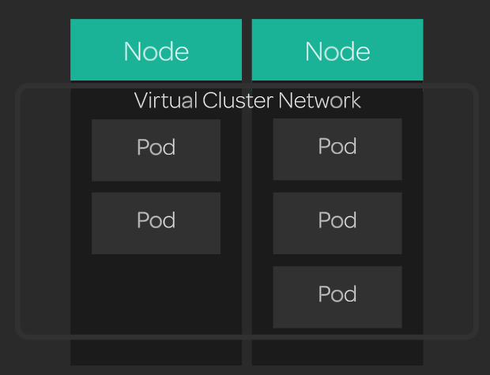

[Back to ACG K8s Essentials](../main.md)

# Networking in Kubernetes

### Concept) Virtual Network
- K8s creates a virtual network across the whole cluster.
- Every pod on the cluster has a unique IP address.
- Using this IP address, pods can communicate with each other.
  - Even among the pods in the different nodes!



<br>

### Concept) Networking Plugin
- K8s supports a variety of networking plugins.
  - We will use Flannel.


### Hands on
- Create a deployment with two nginx pods.
  ```
  cat << EOF | kubectl create -f -
  apiVersion: apps/v1
  kind: Deployment
  metadata:
    name: nginx
    labels:
      app: nginx
  spec:
    replicas: 2
    selector:
      matchLabels:
        app: nginx
    template:
      metadata:
        labels:
          app: nginx
      spec:
        containers:
        - name: nginx
          image: nginx:1.15.4
          ports:
          - containerPort: 80
  EOF  
  ```
- Create a busybox pod to use for testing.
  ```
  cat << EOF | kubectl create -f -
  apiVersion: v1
  kind: Pod
  metadata:
    name: busybox
  spec:
    containers:
    - name: busybox
      image: radial/busyboxplus:curl
      args:
      - sleep
      - "1000"
  EOF
  ```
- Get the IP addresses of your pods.
  ```
  kubectl get pods -o wide
  ```
- Get the IP address of one of the nginx pods, then contact that nginx pod from the busybox pod using the nginx pod's IP address.
  ```
  kubectl exec busybox -- curl [nginx_pod_ip]
  ```


<br>

[Back to ACG K8s Essentials](../main.md)