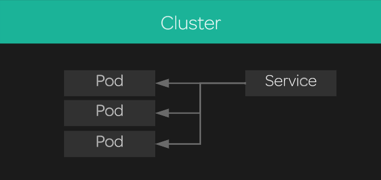
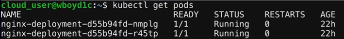

[Back to ACG K8s Essentials](../main.md)

# Kubernetes Services
- Another important component of deploying apps with K8s.
- We can dynamically access a group of replica pods using Services.
- A Service creates an abstraction layer on top of a set of replica pods.
  

### Hands on
- Prerequisite
  - nginx pods should be running in advance.
    
  - Refer to the [Kubernetes Deployment](../04_01/note.md#hands-on) for this!
- Create a NodePort service on top of your nginx pods:
  ```
  cat << EOF | kubectl create -f -
  kind: Service
  apiVersion: v1
  metadata:
    name: nginx-service
  spec:
    selector:
      app: nginx
    ports:
    - protocol: TCP
      port: 80
      targetPort: 80
      nodePort: 30080
    type: NodePort
  EOF
  ```
  - About ports...
    - nodePort : Allows you to expose your server externally.
      - Not recommended for the real deployment...

- Get a list of services in the cluster.
  ```
  kubectl get svc
  ```
  - You should see your service called nginx-service.

- Since this is a NodePort service, you should be able to access it using port 30080 on any of your cluster's servers. You can test this with the command:
  ```
  curl localhost:30080
  ```
  - You should get an HTML response from nginx!

<br>

[Back to ACG K8s Essentials](../main.md)