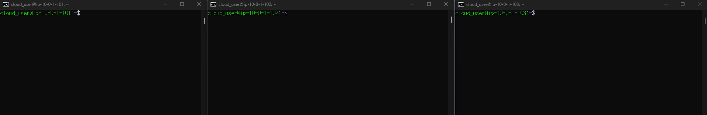
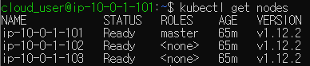
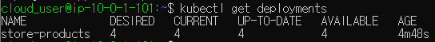
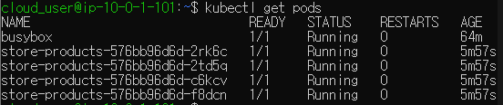
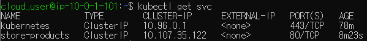
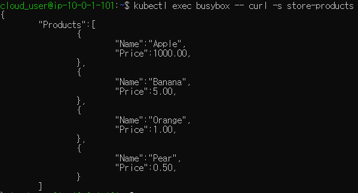

[Back to ACG K8s Essentials](../main.md)

# Deploying a Simple Service to Kubernetes

### Objectives
- Create a deployment for the store-products service with four replicas.
- Create a store-products service and verify that you can access it from the busybox testing pod.

<br>

### Hands on
- Environment
  - Three Servers
    - Kube Master Server
    - Kube Node 1 Server
    - Kube Node 2 Server
  - There is a public Docker image for the store-products app called 
    ```
    linuxacademycontent/store-products:1.0.0
    ```

- Log in to three servers.
  
  - Check the nodes
    ```
    kubectl get nodes
    ```
    

1. Create a deployment for the store-products service with four replicas
   - In Kube Master, create the deployment with four replicas:
     ```
     cat << EOF | kubectl apply -f -
     apiVersion: apps/v1
     kind: Deployment
     metadata:
       name: store-products
       labels:
         app: store-products
     spec:
       replicas: 4
       selector:
         matchLabels:
           app: store-products
       template:
         metadata:
           labels:
             app: store-products
         spec:
           containers:
           - name: store-products
             image: linuxacademycontent/store-products:1.0.0
             ports:
             - containerPort: 80
     EOF
     ```
     - Check the deployments
       ```
       kubectl get deployments
       ```
       
     - Check the pods
       ```
       kubectl get pods
       ```
       
       - The busybox is created inside the package by ACG to check the service in the next task.
       - Rest four pods are the ones that we defined in the deployment yaml file.

2. Create a store-products service and verify that you can access it from the busybox testing pod.
   - In the Kube Master...
   - Create a **service** for the store-products pods:
     ```
     cat << EOF | kubectl apply -f -
     kind: Service
     apiVersion: v1
     metadata:
       name: store-products
     spec:
       selector:
         app: store-products
       ports:
       - protocol: TCP
         port: 80
         targetPort: 80
     EOF
     ```
     - Why doing this?
       - To allow other pods to access the service pods that we just created through this service.
       - This service will dynamically load balance the service pods.
   - Make sure the service is up in the cluster:
     ```
     kubectl get svc
     ```
     
   - Use kubectl exec to query the store-products service from the busybox testing pod.
     ```
     kubectl exec busybox -- curl -s store-products
     ```
     


<br>

[Back to ACG K8s Essentials](../main.md)