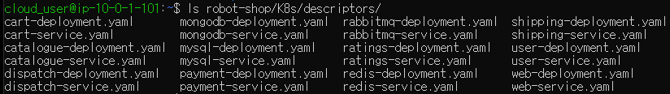

[Back to ACG K8s Essentials](../main.md)

# Microservices

### Concept) Microservices
- Def.)
  - Small and independent services that work together to form a whole application.
  - The break the application up into several small services.
- Monolithic Architecture vs Microservice Architecture
  
- Advantages)
  - Scalability
  - Cleaner code
  - Reliability
  - Variety of tools
    - Different parts of the app can be built using different tools, languages, and frameworks.

<br>

### Hands on) Deploy the Robot Shop App
- Prerequisite
  - Port 30080 should be emptied.
  - In the previous project, we assigned nginx to that port.
    - How to delete
      ```
      kubectl delete svc nginx-service
      ```
- Go to home directory and clone the git repository.
  ```
  cd ~
  ```
  ```
  git clone https://github.com/linuxacademy/robot-shop.git
  ```
  - This repo contains the deployment description for this project.
  - Check the yaml descriptors.
    ```
    ls robot-shop/K8s/descriptors/
    ```
    
- Create a namespace for this project.
  ```
  kubectl create namespace robot-shop
  ```
- Deploy the app using the yaml files above.
  ```
  kubectl -n robot-shop create -f ~/robot-shop/K8s/descriptors/
  ```
  - Check the pods in the namespace that we declared!
    ```
    kubectl get pods -n robot-shop
    ```
    - No pod will be shown if the namespace is not specified.
    - It will take some time for the pods to get ready.
    - Each pod is a microservice!   
      
- Check the app using a browser.
  - Get the public IP address of the Kube Master server.
  - Use that IP address to access the app with a browser.
    ```
    http://[master_public_ip_address]:30080
    ```
    - Recall that the 30080 port is assigned for this app.


<br>

[Back to ACG K8s Essentials](../main.md)