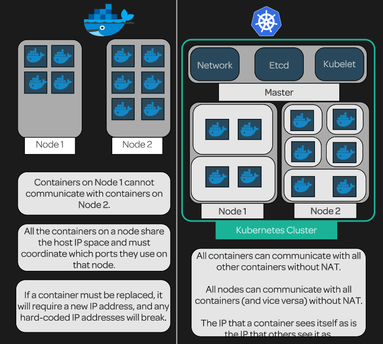

[Back to ACG K8s Quick Start](../main.md)

# Title

### Problems with docker
1. Each node cannot communicate with each other.
    * Why?)
      * Every nodes share the same IP address of the localhost.
      * Thus, we cannot use each node's IP address to target them.
2. Each container in the same node cannot have the same port. They have to switch.
    * Why?)
      * Containers in a same node share the host node's port space.
    * Problem)
      * If we use similar containers in a same node, they cannot use the same port.
3. If a container is replaced, it will require a new IP address.
    * Problem)
      * Any hard-coded IP address will break.
      * Consider the case that we are running a webservice.
        * Webserver and database are running in each containers in the same node.
        * If a DB dies, a new IP address is required when we replace with a new one.
        * The webserver cannot specify the new DB.

             
            
### On the other hand, Kubernetes…
The smallest unit is the pod.
* Each pod can have multiple containers
* Each pod holds the IP address
  * Thus, containers can communicate with one another using different pod IP addresses.
  * Supported by Network Overlay
  * Etcd stores all the keys for a cluster
    * All pods in a cluster are in the same IP space

             
            
### Diagram : Docker vs Kubernetes

 

[Back to ACG K8s Quick Start](../main.md)