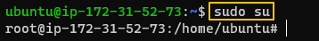
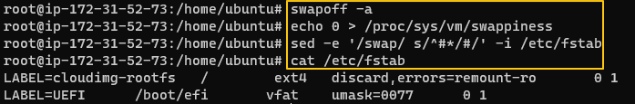
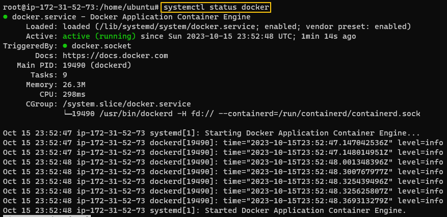
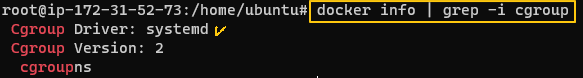
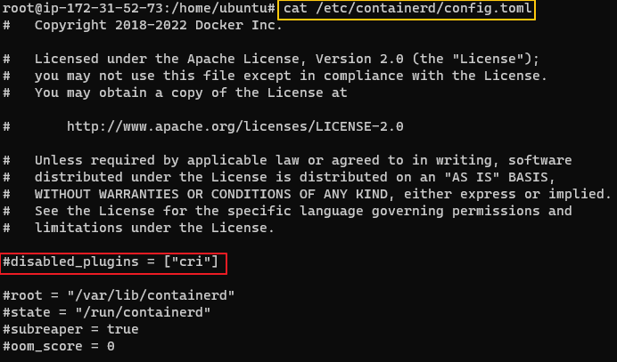
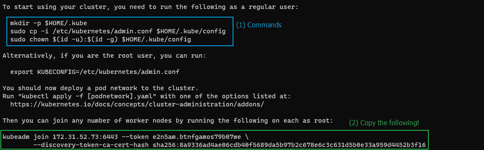
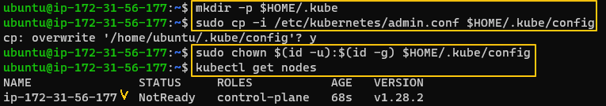
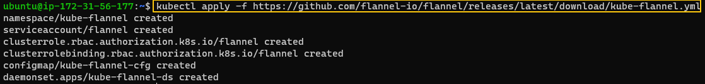
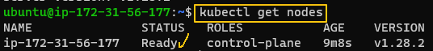
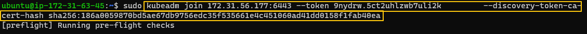

[Back to ACG K8s Quick Start](../main.md)

# Installation

# 1. AWS Ubuntu Install
## 1.1 AWS Settings
#### Security Group Setting
* Inbound Rule : All traffic - Any IPv4
* Outbound Rule : All traffic - Any IPv4

<br>

#### EC2 Configuration
* Ubuntu image
* t2.medium
  * 2CPUs / 4GB RAM
* Two instances
  * Master Node
  * Worker Node

<br>

## 1.2 Installation For Both Master and Worker Node
* Start with the root user.
  ```
  sudo su
  ```
  

* Disable Swap
  ```
  swapoff -a
  ```
  ```
  echo 0 > /proc/sys/vm/swappiness
  ```
  ```
  sed -e '/swap/ s/^#*/#/' -i /etc/fstab
  ```
  

* Install Docker
  ```
  apt-get update && apt-get upgrade -y
  ```
  ```
  apt-get install -y apt-transport-https ca-certificates curl gnupg-agent software-properties-common
  ```
  ```
  curl -fsSL https://download.docker.com/linux/ubuntu/gpg | apt-key add -
  ```
  ```
  add-apt-repository "deb [arch=amd64] https://download.docker.com/linux/ubuntu $(lsb_release -cs) stable"
  ```
  ```
  apt-get install -y docker-ce
  ```
  * Check the docker status
    ```
    systemctl status docker
    ```
    

* Configure the Docker Cgroup Driver to systemd, enable, and start Docker
  ```
  sed -i '/^ExecStart/ s/$/ --exec-opt native.cgroupdriver=systemd/' /usr/lib/systemd/system/docker.service
  ```
  ```
  systemctl daemon-reload
  ```
  ```
  systemctl enable docker --now 
  ```
  ```
  systemctl status docker
  ```
  * Why Doing this?) 
    * To make sure that Docker and K8s are running in the Cgroup
  * Check the result
    ```
    docker info | grep -i cgroup
    ```
    

* Install kubeadm, kubelet, and kubectl
  ```
  apt-get update && apt-get install -y apt-transport-https curl
  ```
  ```
  curl -s https://packages.cloud.google.com/apt/doc/apt-key.gpg | apt-key add -  
  ```
  ```
  cat <<EOF | tee /etc/apt/sources.list.d/kubernetes.list
  deb https://apt.kubernetes.io/ kubernetes-xenial main
  EOF
  ```
  ```
  apt-get update
  ```
  ```
  apt-get install -y haproxy keepalived kubelet kubeadm kubectl
  ```
  ```
  apt-mark hold kubelet kubeadm kubectl
  ```
  * haproxy and keepalived are needed to proceed with the next stpes.

* Enable K8s.
  ```
  systemctl enable kubelet
  ```
  * The kubelet service will not start untill you run "kubeadm init"

* Disable CRI in /etc/containerd/config.toml and restart containerd.
  ```
  sed -i '/"cri"/s/^/#/' /etc/containerd/config.toml
  ```
  ```
  systemctl restart containerd
  ```
  * Check the file.   
    ```
    cat /etc/containerd/config.toml
    ```
    

<br>
    

## 1.3 Installation For Master Node ONLY
* Initialize the cluster using the IP range for Flannel.
  ```
  kubeadm init --pod-network-cidr=10.244.0.0/16
  ```
  * Check the commands to run afterwards and copy the kubeadm join part.
    
  * If something goes wrong, reset with the following command.
    ```
    kubeadm reset
    ```

* Run the commands in (1).
  ```
  mkdir -p $HOME/.kube
  ```
  ```
  sudo cp -i /etc/kubernetes/admin.conf $HOME/.kube/config
  ```
  ```
  sudo chown $(id -u):$(id -g) $HOME/.kube/config
  ```
  * Check nodes.
    ```
    kubectl get nodes
    ```
    
    * Why not ready?)
      * We have not applied the network overlay.

* Apply the network overlay using Flannel
  ```
  kubectl apply -f https://github.com/flannel-io/flannel/releases/latest/download/kube-flannel.yml
  ```
  
  * Check nodes once again.
    ```
    kubectl get nodes
    ```
    

<br>

## 1.4 Installation For Worker Node ONLY
* Paste the "kubeadm join" command that we copied from the master node
  * Be sure to sudo or run in root user
    

* Go back to the **master node** and check if the worker joined.
  ```
  kubectl get nodes
  ```
<br>


<br>

[Back to ACG K8s Quick Start](../main.md)