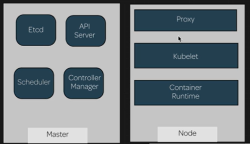

[Back to ACG K8s Quick Start](../main.md)

# Masters and Nodes


### Master
* Components
  * Etcd
    * Key value store for the cluster
    * When an object is created, its state is stored here.
    * Acts as the reference for the cluster state.
    * If the cluster differs from what is indicated here, the cluster is changed to match.
  * API Server
    * Front end for the Kubernetes control plane.
    * All API calls are sent to this server.
    * Sends commands to other services.
    * Basically, this manipulates the pods and containers that are defined in Docker's namespaces.
  * Scheduler
    * When a new pod is created, it determines which node the pod will be run on.
    * Factors that affect this determination.
      * HW
      * workloads
      * affinity
  * Controller Manager
    * Operates the cluster controllers
    * Types
      * Node Controller
        * Responsible for noticing and responding when nodes go down.
      * Replication Controller
        * Responsible for maintaining the correct number of pods for every replication controller object in the system.
      * Endpoints Controller
        * Populates the Endpoints Object
          * i.e.) joins services and pods
      * Service Account & Token Controller
        * Creates default accounts and API access tokens for new namespaces.

### Nodes
* Components
  * Proxy (Pod)
    * Provides network connectivity for services on the nodes that connect to the pods.
    * Runs on the nodes 
    * Services must be defined via the API in order to configure the proxy.
  * Kubelet (Daemon)
    * The primary node agent that runs on each node
    * Uses PodSpec to monitor the pods on its node
      * PodSpec : a provided object that describes a pod
    * Checks the state of its pods and ensures that they match the spec.
  * Container Runtime (Daemon)
    * The container manager
    * Any container runtime that is compliant with the Open Container Initiative
    * Interfaces with a container when Kubernetes needs to instantiate a container inside a pod to build the correct type of container.

### Props.)
* Proxy and network overlay are the only actual pods that are running on a Node.
  * Thus, the Nodes are lightweight
* All of the rest of the pods are running on the Master.
  * How to check?
    * Check nodes in Master
      ```
      kubectl get nodes
      ```
      * Get the server name of Master and a Node
    * List all the pods and grep it with each server name
      * Master
        ```
        kubectl get pods --all-namespaces -o wide | grep <master_server_name>
        ```
      * Node
        ```
        kubectl get pods --all-namespaces -o wide | grep <node_server_name>
        ```

* All the pods and containers in Kubernetes are defined within Docker's namespaces.
  ```
  sudo docker ps
  ```

<br>

[Back to ACG K8s Quick Start](../main.md)