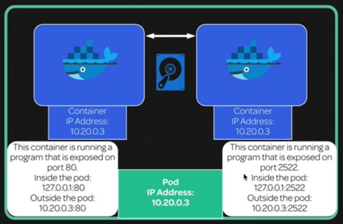

[Back to ACG K8s Quick Start](../main.md)

# Pods and Containers

### Architecture


* Containers in a pod share the port space of the pod.
* All containers can communicate with all other containers without NAT.
* All nodes can communicate with all containers (and vice versa) without NAT.
* The IP that a container sees itself if the IP that others see it as.

<br>

### Hands on
* Check the namespaces in Master.
  ```
  master$ kubectl get namespaces
  ```

* Create a namespace
  ```
  master$ kubectl create namespace <space_name>
  ```

* Create a yaml file.
    ```
    apiVersion: v1
    kind: Pod
    metadata:
    name: examplepod
    namespace: pod-example
    spec:
    volumes:
    - name: html
        emptyDir: {}
    containers:
    - name: webcontainer
        image: nginx
        volumeMounts:
        - name: html
        mountPath: /usr/share/nginx/html
    - name: filecontainer
        image: debian
        volumeMounts:
        - name: html
        mountPath: /html
        command: ["/bin/sh", "-c"]
        args:
        - while true; do
            date >> /html/index.html;
            sleep 1;
            done
    ```
    * args: at the end of the file
      * Makes *filecontainer* container to keep on running.
        * by continuously appending the date value to the shared volume *html*

* Execute the yaml file
  ```
  master$ kubectl create -f <yaml_file>
  ```

<br>

[Back to ACG K8s Quick Start](../main.md)