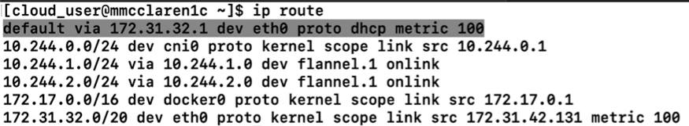

[Back to ACG K8s Quick Start](../main.md)

# Networking

Each Network Plug-in has different Network Policy Rule.
* Flannel does not invoke network policy.
  * Check the [Flannel git hub](https://github.com/flannel-io/flannel#flannel) page for more info.

<br>

### Concept) Network Overlay
* Check the Routes
  ```
  ip route
  ```
  
  * The device with eth0 is the default route.
    * Its private IP address is the actual IP address of this server.
  * The three routes below it are the ones set up by Flannel


### Network Architecture


* DNS is in the Pod's network
  * Their IP addresses are assigned after Flannel(network plug-in) started.    
    
    * Why is it designed like this?
      * The network should be flexible or elastic.
      * Consider that pods can be started and killed frequently.


<br>

[Back to ACG K8s Quick Start](../main.md)