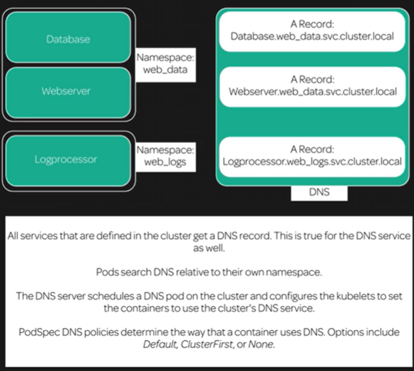

[Back to ACG K8s Quick Start](../main.md)

# DNS

### Architecture


* DNS is used to resolve names.
  * Although each pods have different addresses, we can use them easily using the DNS.

* How to check the namespaces in the cluster
  ```
  kubectl get namespaces
  ```

<br>

[Back to ACG K8s Quick Start](../main.md)