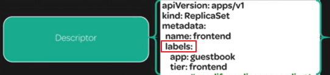
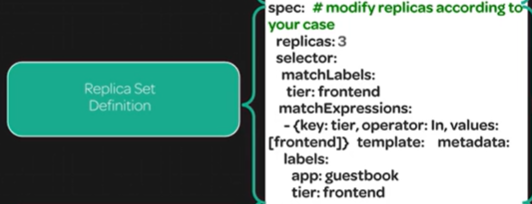
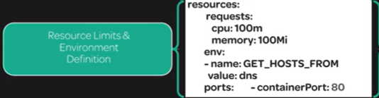

[Back to ACG K8s Quick Start](../main.md)

# Replica Sets

### Concept) Replica Set
* A set of pods that share the same label.
* Contents
  * Descriptor   
    
  * Replica Set Definition   
    
  * Container Definition   
    
  * Resource Limits and Environment Definition    
      

 

### Hands on

[Back to ACG K8s Quick Start](../main.md)